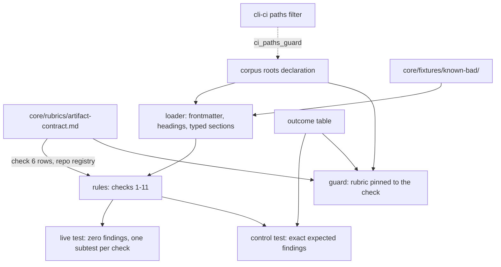
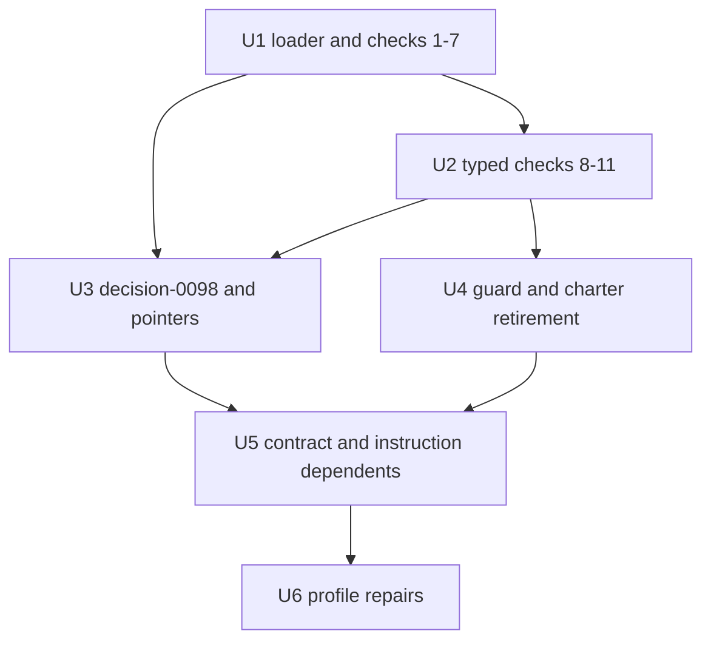

# Corpus conformance CI check - Plan

## Goal Capsule

- **Objective:** A pull request that breaks the artifact contract on this repository's corpus gets a red CI check naming the file, line and rule, without anyone having to remember to invoke a reviewer. The contract rules no program can decide are written where the reviewer of a corpus change reads them.
- **Means:** a deterministic Go test in `cli/`, run by `cli-ci`, replaces the `corpus-reviewer` sub-agent (KTD1).
- **Authority:** Linear TRL-88 and the maintainer's rulings relayed by `trellis-d1`, then the decision records on `main` and `AGENTS.md`, then this plan, then implementer judgment.
- **Execution profile:** headless worker session `trl-88`; test-first per rule; one PR, opened ready for review.
- **Stop conditions:**
  - The live corpus fails a mechanical rule in a way that needs a record's substance changed, not a frontmatter pointer added. Raise a DECISION to `trellis-d1`.
  - Any change under `plugins/trellis/` becomes necessary. Stop and ask; it would be a release.
  - The work needs a decision id other than `decision-0098`.
  - Evidence shows a rule the maintainer expects enforced cannot be decided by a program.
- **Finishes:** the `trl-88` worker carries the work to an open PR; the maintainer merges.

---

## Product Contract

### Summary

A Go test in `cli/` applies the mechanically decidable parts of rubric checks 1–11 to the corpus on every PR that touches it. It proves it can fail against a seeded fixture corpus, and it carries a recorded outcome for every part of every check. The plan retires `.claude/agents/corpus-reviewer.md`, updates each dependent, and adds `decision-0098`. Nothing Trellis ships to consumers changes.

### Problem Frame

Conformance of `decisions/`, `research/`, `core/` and `profiles/` to `core/rubrics/artifact-contract.md` is applied today by `corpus-reviewer`, an LLM sub-agent that `AGENTS.md` asks authors to invoke before merging. Nothing runs it automatically. `cli-ci`'s paths filter does not include `decisions/` or `research/` (`.github/workflows/cli-ci.yml:31,34`), and the agent reports in prose, so a skipped or misread run leaves no trace.

The agent's reading has also drifted from the contract. TRL-60 review found the charter and the rubric disagreeing in eight places (`cli/artifact_contract_guard_test.go`, header comment). The agent has repeatedly reported `decisions/0044-cross-repo-depends-on-convention.md:5` as a FAIL (the self-check in `decisions/0092-a-claim-is-a-new-record-path.md`), although the rubric's check 4 accepts a `<repo>/<id>` reference on shape and registry membership alone.

The maintainer decided on 2026-09-13 to move the checks into a deterministic script that runs in CI, and to retire the agent (TRL-88).

### Key Decisions

- **A deterministic CI check replaces the agent-applied review.** Governs R1, R2, R3, R4, R8. (session-settled: user-directed — chosen over keeping `corpus-reviewer` as an agent invoked before merge: its prose reports are enforced by nothing, TRL-88)

### Requirements

**The check**

- R1. Every mechanically decidable rule in rubric checks 1–11 is applied to the corpus by a deterministic check, and each violation is reported with its file, line, check number and rule.
- R2. The check runs in CI on every pull request and every push to `main` that touches a corpus path, the rubric, the fixtures, or the check itself.
- R3. The live corpus passes clean. A missing or unreadable input that the check depends on fails the run by name and never yields a partial pass.
- R4. Corpus locations resolve through one declaration in the check, so moving `decisions/` and `research/` (TRL-89) is a one-line change there. The rubric's **Corpus:** paragraph and the `cli-ci` paths filter mirror that declaration and are pinned to it by guards that fail; other files that name those paths move with TRL-89.

**Accounting for every rule**

- R5. Every part of every rubric check has a recorded outcome with its reason, from the Check outcomes vocabulary: implemented, accepts, halts, covered, dropped, guidance, no rule, retired or rewritten. A guard fails when a numbered rubric check has no outcome, or when a check's text changes without its outcome rows being re-reviewed.
- R6. Parts kept as review guidance are written where a named reviewer reads them.

**Positive control**

- R7. Every implemented rule has at least one seeded violation, and the check reports exactly the expected findings on the fixture corpus, with none missing and none extra.

**Retirement and records**

- R8. `.claude/agents/corpus-reviewer.md` is deleted, and every live dependent is updated in the same PR (`decision-0028`).
- R9. `decision-0098` records the change, names what it supersedes in part, and states that nothing Trellis ships changes.
- R10. The profile rows that cite `corpus-reviewer` as evidence are repaired under the profile's own repair convention (`profiles/trellis-self.md:13-19`), naming `decision-0098`.

### Success Criteria

- A branch that adds a decision without `## Consequences` gets a red `build-test` job naming that file and check 6, with no manual step.
- Deleting the logic of any implemented rule turns the positive-control test red.

### Scope Boundaries

- Nothing under `plugins/trellis/` changes, and `plugins/trellis/VERSION` does not move.
- Repository settings are not changed. The check stays advisory, like every other guard in this repository (A9).
- The text of rubric checks 1–12 is not reworded. Only the rubric's framing sections change (U5).
- Historical mentions of `corpus-reviewer` stay as written: append-only decisions, `research/0012`'s `status:` comment, the plans and specs under `docs/superpowers/`, and the dated repair notes in `profiles/trellis-self.md`.
- `.github/workflows/claude-code-review.yml` is not edited (A11).
- No type registry is built for check 2's centrally declared scope (A4).

---

## Planning Contract

### Key Technical Decisions

- KTD1. **A Go test in `cli/`, not a standalone script or a new workflow.** The `cli` module is dependency-free Go (`decision-0043`), and `cli-ci` already runs `go test -count=1`. `cli/ci_paths_guard_test.go` fails unless the paths filter covers every repository path a test reads, so adding the corpus reads forces the coverage R2 needs rather than leaving it to a hand-maintained filter. Test files stay out of the binary and out of the coverage floor. `decision-0010`'s fourth Decision bullet already permits a project's own-stack helper for CI gating, and this repository's stack is Go. Cost: a decision-only PR now also runs `npm ci`, ShellCheck and staticcheck inside `build-test`.
- KTD2. **One corpus-roots declaration, written as `../`-prefixed string literals.** This declaration is the only place the check names corpus paths (R4). The literal form is what `ci_paths_guard_test.go` extracts; a loop joining bare directory names would be invisible to it. Every rule keys on an artifact's `type`, never its directory, so a move changes no rule.
- KTD3. **The rubric is read as data where it states data, and implemented as code where it states logic.** The check reads check 6's type-to-sections rows and check 4's cross-repo registry list from the rubric at test time, reusing `contractWindow` and `contractRows` from `cli/artifact_contract_guard_test.go`, so no second copy can drift. Check 4's five accepted forms are code, and the guard maps each rubric row to one implemented form (U4). The pinned row counts stay at 10 and 5.
- KTD4. **Registries are found by artifact id, not by path.** Retired ids come from the Identifiers section of the artifact whose id is `invariants-v1`, and from the §3a table of `decision-0079`. Check 8's slug coverage is not re-derived here: `TestRowSetDerivativesFollowThePin` already fails when the catalog or the invariant set differs from the pinned slug set (Check outcomes, 8a and 8d).
- KTD5. **Finding contract.** One finding per violation, as `<path>:<line>: check <N> (<rule-id>): <detail>`. A missing section is one finding per section. A dangling supersession pointer is a check 7 finding, not a check 4 one. Findings are collected over the whole corpus first and reported per check in subtests, so `go test -v` shows PASS or FAIL for each check.
- KTD6. **Halt policy.** The run halts only when a shared input is missing or unparseable: a corpus root that is absent or holds no artifacts, a rubric enumeration marker, a registry artifact or its table, or a catalog's entries section when a profile needs it. A problem inside one file, such as malformed frontmatter or a missing heading, is a finding, so one bad file never hides the others.
- KTD7. **The positive control is a standalone fixture corpus on disk.** `core/fixtures/known-bad/` holds a small self-contained corpus with its own `invariants-v1`, `decision-0079`, catalog and profile. It contains seeded violations and deliberately valid constructs. The expected findings live in Go as an exact multiset keyed by file, rule id and the detail the finding names (the missing field or section, the dangling reference, the slug or the pair position), so two findings of one rule in one file are each required. This was chosen over in-memory mutations of live artifacts, because a mutation breaks whenever unrelated live text changes, and because the rubric already names `core/fixtures/` as its positive control. `core/fixtures/known-bad.md` moves into the new directory.
- KTD8. **The outcome table is enforced data.** The check carries one row per rule from Check outcomes below, keyed by rule id, or by clause name for the three unnumbered rows. Each row carries one of the table's outcomes (implemented, accepts, halts, covered, dropped, guidance, no rule, retired, rewritten) and its reason.
  - An implemented rule reports findings and needs at least one seeded violation in the expected set.
  - An accepts rule only accepts or exempts input and needs a deliberately valid fixture construct that yields no finding.
  - The halts row is proven by the halt scenarios in U1 and U2.
  - Each numbered check's rows also carry a digest of that check's normalized rubric text, so an edit anywhere in a check, prose included, fails the guard until its rows and rule code are re-reviewed in the same PR.
  - The guard fails when a numbered rubric check (1–12) has no row or its digest no longer matches. The control test fails when an implemented rule has no expected finding or an accepts rule has no valid construct.
- KTD9. **Heading match.** A required section is an H2 whose text, compared case-insensitively, is the section name alone or the name followed by ` (`. Fenced code blocks are skipped. The rule accepts `## Decision (direction — draft, for future reasoning)` in `decisions/0008` and `## Consequences (execution — downstream, deferred)` in `decisions/0047`, and it rejects `## Decision state`.
- KTD10. **Frontmatter parsing is line-based.** Every corpus frontmatter line is a single-line `key: value`. A flow-list value ends at its closing `]`, and the rest of the line is a comment that may contain brackets, colons and pipes. Keys the rubric does not type are not validated; `supersedes: invariants-v0` is a scalar and passes.
- KTD11. **Review guidance is stated in `AGENTS.md`, citing the rubric.** The two guidance rules (5d and 10b) are already prose inside rubric checks 5 and 10. The conformance bullet in `AGENTS.md` states each in one sentence and cites its rubric check. `ce-code-review`'s project-standards reviewer grades changed files against the root `AGENTS.md` and must cite a rule from a standards file, so the rule is written there rather than pointed at (A11). Outcome rows 5d and 10b name that bullet as the guidance home, so KTD8's digest on checks 5 and 10 forces the pair to be re-reviewed together (`decision-0028`).
- KTD12. **Supersession scope.** `decision-0098` supersedes, in part: `decision-0010`'s second Decision bullet as it applies to this repository's own gate; `decision-0076` point 6's standing rule; and `decision-0089`'s Consequences sentence "Artifact **conformance** stays agent-applied via `corpus-reviewer`". Each record gains a clause-scoped forward pointer (A5).

### Check outcomes

| Rule | Rubric text | Outcome | Notes |
|---|---|---|---|
| 1a | Frontmatter present | Implemented | The file opens with a `---` block |
| 1b | `id`, `type`, `depends_on`, `owner` present | Implemented | Each once and non-empty; `status` is never required or flagged |
| 1c | Well-typed | Implemented | `depends_on` is a flow list; `informed_by`, `superseded_by`, `superseded_in_part_by` and `changes` are flow lists when present; `id`, `type`, `owner` are scalars |
| 2a | `type` declared | Implemented | The value is a row of check 6's closed enumeration |
| 2b | `scope` values | Implemented | A per-file `scope` is `core-methodology`, `trellis-product` or `trellis-meta` |
| 2c | Scope and rubric "may be declared centrally" | Dropped | No central declaration exists (the rubric's own open question); 107 of 112 files carry no per-file `scope`, so enforcing it would reject valid artifacts |
| 2d | Recognized typed artifacts and their scopes | Dropped | Descriptive; typed checks key on `type`, and 2b validates any declared `scope` |
| 3 | `id` unique | Implemented | Names both files |
| 4a | An existing corpus id | Accepts | |
| 4b | `brief-§…` | Accepts | Shape only: a non-empty section token |
| 4c | `<repo>/<id>` in the registry | Accepts | Registry list read from the rubric; not verified against the other repository |
| 4d | Retired id in the invariant set's registry | Accepts | Read by id (KTD4) |
| 4e | Retired artifact id in `decision-0079`'s registry | Accepts | Read by id |
| 4f | `@version` pin | Accepts | Stripped before resolving; no pin-versus-upstream comparison |
| 4i | A `depends_on` entry matches none of 4a–4f | Implemented | One finding naming the entry |
| 4g | `informed_by` resolves by the same forms | Implemented | |
| 4h | `@version` pin on `informed_by` | Implemented | A category error, reported before stripping, and no second finding follows |
| 5a | Every `depends_on` resolves in the corpus | Covered by 4 | No separate code |
| 5b | Status-lifecycle form | Dropped | This repository declares no lifecycle (`decision-0082`) |
| 5c | `changes:` is shape only and not a flow edge | Covered by 1c | No rule walks edges |
| 5d | Coupling relabeled as `informed_by` | Review guidance | Whether an artifact's correctness rests on a source is judgment (`decision-0047`); stated in the `AGENTS.md` conformance bullet (KTD11) |
| 6a | Required sections per type | Implemented | Rows read from the rubric (KTD3); heading rule KTD9 |
| 6b | Exempt types | Accepts | `feedback`, `schema` |
| 6c | Research-note sources and confidence tags | No rule | The rubric states they are not gated |
| 7a | `superseded_by` entries resolve | Implemented | |
| 7b | `superseded_in_part_by` entries resolve | Implemented | |
| 7c | Revise-in-place docs re-point | Implemented | A non-`decision` artifact may not `depends_on` one carrying `superseded_by`, unless it is listed as that artifact's successor |
| 8a | Catalog covers assessable slugs | Covered by `TestRowSetDerivativesFollowThePin` | That guard fails when the catalog's entries or the invariant set's live entries differ from the pinned slug set in `cli/payload_test.go`, which holds no dial or collapsed slug |
| 8b | Ten fields per entry | Implemented | Handles `·`-joined fields, wrapped lines and bolding |
| 8c | At least 2 matched pairs with aligned tags | Implemented | Tags compared exactly, including uppercase `CI` and `ADR` |
| 8d | A dial entry is present | Covered by `TestRowSetDerivativesFollowThePin` | A dial entry reads there as an extra slug |
| 9 | Profile slug resolves to a catalog entry | Implemented | |
| 10a | `confidence` and `evidence` present | Implemented | `confidence` is `verified`, `inferred` or `speculated` (`schema-typed-artifacts`) |
| 10b | The evidence supports the claim | Review guidance | Whether a pointer shows the tell is judgment; stated in the `AGENTS.md` conformance bullet (KTD11) |
| 11 | No `C2: none` on `intent_locus: true` | Implemented | |
| 12 | Version cross-check | Retired | No check; the number is kept |
| — | Honesty clause | Halts | Findings per KTD5 and halts per KTD6, proven by the halt scenarios in U1 and U2; the charter's own wording retires with the charter |
| — | How it is graded | Rewritten | Describes the test's output (U5) |
| — | Charter: "derive your checklist yourself" | Dropped | An instruction to an agent; the checklist is now code pinned to the rubric, and CI runs it whoever authored the change |

### High-Level Technical Design



Unit order:



### Output Structure

```text
cli/
  corpus_conformance_test.go          new: roots, loader, rules, live and control tests
  corpus_conformance_typed_test.go    new, optional split for checks 8-11
  artifact_contract_guard_test.go     rewritten
core/fixtures/
  README.md                           rewritten
  known-bad/                          new: standalone fixture corpus
    known-bad.md                      moved from core/fixtures/
decisions/
  0098-artifact-conformance-is-a-ci-check.md   new
.claude/agents/corpus-reviewer.md     deleted
```

### Assumptions

These are calls made without a user present, each with its default taken. Rows marked **(confirm)** fall under the worker protocol's records and gates questions, and go to `trellis-d1` before implementation.

- A1. The Go-test form (KTD1) is taken over a standalone script with its own workflow.
- A2. The rubric is read as data for check 6's rows and the registry list (KTD3), rather than mirrored into Go tables.
- A3. The positive control is an on-disk fixture corpus (KTD7).
- A4. Check 2's centrally declared scope is dropped rather than kept as review guidance; the rubric's existing open question already carries it.
- A5. **(confirm)** Supersession scope per KTD12: `decision-0010` bullet 2 in part (this repository's gate only), `decision-0076` point 6, and one sentence of `decision-0089`.
- A6. **(confirm)** Consumers are unaffected. `plugins/trellis/` carries no rubric, fixture or agent, and the rubric stays runtime-free prose that a consumer's agent or its own check can apply.
- A7. **(confirm)** The rubric changes beyond its **Derived resource** line: the header blockquote, `## How it is graded`, the acceptance criterion "applied by an agent with no runtime", and `decision-0098` added to `depends_on`. Review guidance goes in `AGENTS.md`, not a new rubric section (KTD11).
- A8. **(confirm)** Profile rows keep `confidence: verified` with re-argued evidence. `inv-bounded-context` is re-argued from `depends_on` declared on every artifact (now checked in CI) and from the single payload-read gateway and pinned read budget (`decision-0087`, `decision-0090`), quoted from source in U6. The sub-agent tell leaves with the agent. The alternative is to lower that row to `inferred`. Separately, the eight rows whose C2 is `independent-agent` keep that value; whether a deterministic check still counts as that gatekeeper is a verdict question the profile's convention does not re-run, left for the maintainer.
- A9. CI stays advisory. `main` carries no branch protection (`.github/workflows/decision-id-guard.yml:15-16`), and `decision-0098` says so.
- A10. The agent's past FAILs on `decisions/0044:5` and `research/0010:5` become passes. `decision-0098` names both rather than special-casing them.
- A11. Whether `/code-review:code-review` in `.github/workflows/claude-code-review.yml` reads `AGENTS.md` is unverified, so KTD11 rests on `ce-code-review` alone.
- A12. `eval/experiments/annotation-vs-absence/README.md:41` keeps its historical "corpus-reviewer PASS" and gains a pointer to `decision-0098`.
- A13. The `boundedReferences` entry in `cli/selfapply_test.go` is removed without adding an absence assertion, since nothing reinstalls the file.

### Risks

| Risk | Mitigation |
|---|---|
| The parser false-FAILs valid live artifacts | The live test runs from U1's first rule; the known edge cases are test scenarios |
| A rubric reword breaks the enumeration read | The run halts naming the marker (KTD6) |
| TRL-89 merges first | Merge `origin/main`, change the roots line, and follow the guard's failures on the rubric paragraph and filter; `docs/**` is already in the filter. The decision-id guard's workflow and script also name `decisions/`, and nothing here pins them |
| A red check does not block a merge | Stated in `decision-0098` (A9) |
| `TestDocsClaimOnlyRealCommands` rejects a lowercase `trellis` followed by a space and a word | Keep that phrasing out of edited prose in `AGENTS.md`, `core/README.md`, the rubric, the profile and this plan |
| `scripts/check-todos.sh` flags a bare debt marker in Go | None in new test code |

### Sources and research

- `.claude/agents/corpus-reviewer.md`, `core/rubrics/artifact-contract.md`, `core/schemas/typed-artifacts.md`, `core/fixtures/README.md`
- `cli/artifact_contract_guard_test.go`, `cli/ci_paths_guard_test.go` (read-path forms), `cli/row_set_guard_test.go`, `cli/selfapply_test.go:177-210`, `cli/docs_consistency_test.go:163-192`, `cli/apply.go` (`catalogSlugOrder`)
- `decisions/0010`, `decisions/0028`, `decisions/0076` (point 6), `decisions/0079` (§3a), `decisions/0082`, `decisions/0089` (Consequences), `decisions/0092` (Self-check)
- `.github/workflows/cli-ci.yml:11-34`, `.github/workflows/decision-id-guard.yml:15-16`, `.github/workflows/repo-hygiene.yml:3-8`
- No `docs/solutions/` learnings and no Compound Packs exist in this repository.

---

## Implementation Units

### U1. Corpus loader and checks 1–7

**Goal:** the corpus model, frontmatter and heading parsing, checks 1–7, the fixture harness, and the live run.

**Requirements:** R1, R2, R3, R4, R7 for checks 1–7.

**Dependencies:** none.

**Files:**
- Create `cli/corpus_conformance_test.go`.
- Create fixture files for checks 1–7 under `core/fixtures/known-bad/`, and move `core/fixtures/known-bad.md` into it.
- Create the fixture registries there: an `invariants-v1` artifact with an Identifiers section, and a `decision-0079` artifact with a retired-artifacts table (KTD4).
- Modify `.github/workflows/cli-ci.yml`: both `paths` lists gain `decisions/**`, `research/**`, `core/schemas/**`, `core/lexicon.md` and `core/fixtures/**`.

**Approach:**
1. Declare the corpus roots per KTD2, with `core/fixtures/` outside them.
2. Load each root's Markdown files with line numbers, parsing per KTD10 and KTD9.
3. Read check 6's rows and the registry list from the rubric (KTD3).
4. Implement rules 1a–7c per Check outcomes, with findings per KTD5 and halts per KTD6.
5. Expose one root-parameterized entry point, called by the live test on the corpus roots and by the control test on the fixture root.

**Execution note:** test-first per rule. Add the seeded fixture and its expected finding, see the control test fail, then implement the rule.

**Patterns to follow:** `docSurfacesIn` in `cli/docs_consistency_test.go` and `scanForSurfaceMatrixFiles` in `cli/surface_matrix_guard_test.go`, each wrapped by a real-repo test and a fixture test; row extraction in `cli/artifact_contract_guard_test.go`; `readFileT` in `cli/install_script_test.go`.

**Test scenarios:**
- The live corpus yields zero findings, and every per-check subtest passes.
- `decisions/0091`'s `depends_on` line, whose trailing comment contains brackets, colons and pipes, parses to the list before the comment.
- `supersedes: invariants-v0` and a legacy `status: approved  # …` line produce no finding.
- `spec-0007@v1` in `decisions/0060` resolves through `decision-0079`'s registry after the pin is stripped.
- `kodhama/kodhama-0004-uniform-lifecycle` in `decisions/0044` passes.
- Fixture with no frontmatter yields 1a.
- `known-bad.md` yields 1b (`owner`), 4a (`decision-9999`), two 6a findings (`Acceptance criteria`, `Open questions`) and 7a (`decision-9998`).
- Fixture whose `depends_on` is a scalar yields 1c.
- Fixture with an unknown `type` yields 2a and no check 6 finding.
- Fixture with `scope: trellis-core` yields 2b.
- Two fixtures sharing an id yield one check 3 finding naming both files.
- `notarepo/x`, `brief-§` with no section, and `spec-0009` each yield one 4i finding.
- Valid fixture constructs for the accepts rows yield no finding: a corpus id, `brief-§3`, a registry-member `<repo>/<id>`, a retired id from each fixture registry, a pinned `depends_on` entry, and a `schema` artifact with no sections.
- `informed_by: [decision-0001@v1]` yields 4h and no resolution finding.
- A fixture decision with only `## Decision state` yields 6a for `Decision`. One with `## Decision (draft)` yields none. A `## Consequences` line inside a fenced block does not count.
- A dangling `superseded_in_part_by` yields 7b.
- A fixture research note depending on a fully superseded fixture decision yields 7c. A decision depending on it, and its listed successor depending on it, yield none.
- The entry point reports an error naming a missing or empty root, and the test halts on it.
- The control test's findings equal the expected set exactly.

**Verification:** the live and control tests pass. `TestCIPathFilterCoversEveryPathTheSuiteReads` passes, and fails when `decisions/**` is removed from the filter locally before being restored.

### U2. Typed checks 8–11

**Goal:** catalog and profile parsing, and rules 8b, 8c, 9, 10a and 11. Rules 8a and 8d are covered by the row-set guard (Check outcomes).

**Requirements:** R1, R7 for checks 8–11.

**Dependencies:** U1.

**Files:**
- Modify `cli/corpus_conformance_test.go`, or create `cli/corpus_conformance_typed_test.go` if the split reads better.
- Create a fixture catalog and a fixture profile under `core/fixtures/known-bad/`.

**Approach:**
1. Read catalog entries between `## Entries` and the next H2. Join each two-space field bullet with its continuation lines, strip bolding, and split combined lines on `·`.
2. Read profile rows from the `## Profile` table, locating columns by header name.
3. Implement rules 8b, 8c, 9, 10a and 11 per Check outcomes.

**Execution note:** test-first per rule, as in U1.

**Patterns to follow:** `catalogSlugOrder` in `cli/apply.go`; `catalogClassCounts` and the profile row pattern in `cli/row_set_guard_test.go`.

**Test scenarios:**
- All 16 live catalog entries parse all ten fields, including wrapped `intent_locus` lines and bold `**intent_locus: `true`**` in `core/catalog/signature-catalog-v1.md`.
- `inv-graph-maintenance` parses 4 aligned pairs, including uppercase tags.
- All 16 live profile rows parse, and `inv-intent-locus` and `floor-intent-gate` resolve to catalog entries with `intent_locus: true`.
- A fixture entry missing `why` yields 8b naming `why`. One whose combined line lacks `default_C2` yields 8b naming `default_C2`.
- A fixture entry with one honored and one violated example yields 8c. One whose second tags differ, `(CI)` against `(ops)`, yields 8c naming position 2.
- A fixture profile row for an unknown slug yields 9.
- A fixture active `honored-implicitly` row with empty evidence yields 10a, and one with `likely` as its confidence yields 10a.
- A fixture row with `C2: none` on an intent-locus slug yields 11. The same value on another slug yields none.
- A fixture corpus whose catalog has no `## Entries` while a profile exists halts, naming the catalog.

**Verification:** the live and control tests pass with the typed rules in the expected set.

### U3. Decision record and forward pointers

**Goal:** record the change in `decision-0098` and mark what it supersedes in part.

**Requirements:** R9.

**Dependencies:** U1, U2. The record names the files they create, and their live run checks it.

**Files:**
- Create `decisions/0098-artifact-conformance-is-a-ci-check.md`.
- Modify the frontmatter of `decisions/0010-no-runtime-agent-instructions.md`, `decisions/0076-retire-grove.md` and `decisions/0089-a-decision-id-is-claimed-at-the-pr-not-in-the-directory.md`.

**Approach:**
1. Write frontmatter in `decision-0097`'s shape: `id`, `type: decision`, `depends_on`, `informed_by` for provenance only (`decision-0047`), `changes` for the corpus artifacts it edits, `owner: agent`, `date`, and no `status`.
2. Use the sections Context, Decision, Consequences and Self-check. Add Open questions only if one is real.
3. The Decision states: the check replaces the agent for this repository's gate; the dropped and guidance rows of Check outcomes, with reasons; the supersession scope (KTD12); that no shipped surface changes (A6); that the gate is advisory (A9); and that the two past FAILs now pass (A10).
4. Append the forward pointers with clause-scoped comments, keeping each record's existing comment text. `decisions/0068` shows the `|`-separated form.

**Patterns to follow:** `decisions/0097-compound-engineering-replaces-superpowers.md`, `decisions/0082-retire-the-status-field.md`, and the `superseded_in_part_by` comments in `decisions/0079` and `decisions/0068`.

**Test expectation:** none new. U1's live run must stay at zero findings with the record and pointers in place.

**Verification:** the live test passes, and the decision-id guard finds `0098` unclaimed by any other branch.

### U4. Guard pinned to the check, and the agent retired

**Goal:** replace the charter-to-rubric pins with check-to-rubric pins, and delete the charter.

**Requirements:** R4, R5, R8.

**Dependencies:** U1, U2.

**Files:**
- Modify `cli/artifact_contract_guard_test.go`.
- Delete `.claude/agents/corpus-reviewer.md`.
- Modify `cli/selfapply_test.go`: remove the charter's `boundedReferences` entry.
- Modify `.github/workflows/cli-ci.yml`: the header comment names the check instead of the charter.

**Approach:**
1. Corpus: the paths in the rubric's **Corpus:** paragraph equal the roots declaration plus the excluded fixture root.
2. Check 4: each of the five rubric rows maps to one implemented form by its leading text. An unmapped row or an unmapped form fails, and the count stays 5.
3. Check 6: every row parses to a type with its sections or `exempt`, and the count stays 10.
4. Numbered checks: every top-level ordered item `N.` in the rubric's check sections has a row in the outcome table, whether the item is bold or italic (check 12 is italic). The count is pinned at 12, and no row names a number the rubric lacks.
5. Every implemented rule appears in the control test's expected set, and every accepts rule names its valid fixture construct (KTD8). This assertion may live in the control test instead.
6. Text digests: each numbered check's normalized text, whitespace collapsed from its item marker to the next item or heading, matches the digest its outcome rows carry. A mismatch fails naming the check and printing the new digest.

**Patterns to follow:** `contractWindow`, `contractRows` and `contractCompare` in the current guard, and its failure-message style.

**Test scenarios:**
- The guard passes on the current rubric and the new check.
- Where a comparison is a function over strings, one seeded-input case per failure path: a check 4 row with changed leading text fails naming the row; a corpus path in the rubric paragraph and not in the roots fails naming the path; an outcome table missing check 9 fails naming check 9; an implemented rule with no expected finding fails naming the rule; one changed word inside check 4's prose fails naming check 4.

**Verification:** `cd cli && go test -count=1 ./...` passes with the charter deleted, and nothing under `cli/` mentions `corpus-reviewer`.

### U5. Contract and instruction dependents

**Goal:** every live surface describes the check instead of the agent.

**Requirements:** R6, R8, R9.

**Dependencies:** U3, U4.

**Files:** modify `core/rubrics/artifact-contract.md`, `AGENTS.md`, `core/README.md`, `core/fixtures/README.md`, `.github/workflows/repo-hygiene.yml` and `eval/experiments/annotation-vs-absence/README.md`.

**Approach:**
1. Rubric (A7): the header blockquote names the check; the **Derived resource** paragraph names the check and the guard, keeping the `**Derived resource` and **Corpus:** markers; `## How it is graded` describes KTD5 to KTD7; the "applied by an agent with no runtime" criterion names the check for this repository and keeps the rubric runtime-free for consumers; `depends_on` gains `decision-0098`. The text of checks 1–12 is unchanged.
2. `AGENTS.md`: the conformance bullet under "Checks and review" says conformance is CI-applied (`decision-0098`), gives the local test command, and states the two review-guidance rules (Check outcomes 5d and 10b) in one sentence each, citing rubric checks 5 and 10 (KTD11).
3. `core/README.md`: artifact conformance runs as the check; conformance of code to its authorizing decision stays uncovered.
4. `core/fixtures/README.md`: describes the fixture corpus and points at the expected set in Go, replacing the prose answer key.
5. `repo-hygiene.yml`: the header comment stops saying `research/` and `decisions/` are outside `cli-ci`.
6. The eval README gains a pointer to `decision-0098` after "corpus-reviewer PASS" (A12).

**Test expectation:** none new. The live test (rubric and record conform), `TestDocsClaimOnlyRealCommands`, `TestSharedProjectInstructionEntrypoints` and U4's guard must pass.

**Verification:** none of the files U5 edits names `corpus-reviewer` as a live mechanism, and the tests named above pass.

### U6. Profile evidence repairs

**Goal:** repair the `profiles/trellis-self.md` rows that cite `corpus-reviewer`.

**Requirements:** R10.

**Dependencies:** U5.

**Files:** modify `profiles/trellis-self.md`.

**Approach:**
1. Header: add a repair paragraph in the voice of the existing three, naming `decision-0098` as the change that broke these pointers. Update the header's dates line (`:13-15`) to carry the `decision-0098` repair date, and extend its "opened against its source" statement to that repair.
2. Delivery (`:62-65`) and `inv-gate-at-handover` (`:85`): re-point to the check in `cli-ci` and the rewritten `AGENTS.md` bullet. For `:85`, re-argue `default-on-but-skippable` from the check being advisory (no branch protection on `main`, A9), replacing the sentence that rests it on an agent-applied gate and `decision-0010`.
3. `inv-independent-judgment` (`:86`): re-argue from the check's construction (its checklist is pinned to the rubric, it runs on every corpus PR, and it fails its fixture corpus), keeping the `decision-0076` defect count and the `decision-0007` workflow evidence.
4. `inv-bounded-context` (`:88`): re-argue per A8, quoting `decision-0087` and `decision-0090` from source.
5. `floor-transparency` (`:94`) and the Assessment note (`:111-117`): rest the evidence on the rubric's honesty clause, which names `floor-transparency`, and on the check's halt contract that implements it, dropping "named by slug in both honesty clauses". In the note, "the reviewer's construction" becomes the check's construction.
6. Keep the table's columns and every `| true |` value, which `TestRowSetDerivativesFollowThePin` matches.
7. Header note (`:29-31`): amend in place its claim that the `independent-agent` column is filled by `corpus-reviewer`, re-pointing it to the conformance check and `decision-0007`'s workflow under the same repair convention.

**Test expectation:** none new. The live check (checks 9–11 on the profile) and the row-set guard must pass.

**Verification:** every quoted line was opened against its source, and the live test passes. A repository-wide search for `corpus-reviewer` finds only history: append-only decisions, `research/0012`, `docs/superpowers/`, the eval pointer, the profile's dated repair notes and re-argument notes, `decision-0098` and this plan.

---

## Verification Contract

| Gate | Command | When |
|---|---|---|
| Build and vet | `cd cli && go build ./... && go vet ./...` | Every unit |
| Tests | `cd cli && go test -count=1 ./...` | Every unit |
| Repository quality | `npm run quality` | Before push; ShellCheck may be missing locally, and CI runs it |
| Filter coverage proof | Remove `decisions/**` from both `cli-ci.yml` filters locally, confirm `TestCIPathFilterCoversEveryPathTheSuiteReads` fails, then restore | U1 |
| This PR's own records | The live test covers `decision-0098`, the edited rubric and the edited profile | U3, U5, U6 |

---

## Definition of Done

- TRL-88's "Done when" holds: the check runs in CI and fails on each seeded violation, `.claude/agents/corpus-reviewer.md` is gone, every dependent is updated, and `cd cli && go test -count=1 ./...` passes.
- The check's outcome table reflects every row of Check outcomes, and the guard and control test enforce R5 and R7.
- `npm run quality` passes, or the PR names the tool that was missing locally.
- No abandoned experiments, scratch fixtures or dead code remain in the diff.
- The PR body lists the calls made without asking and a checklist of unapplied review findings.
