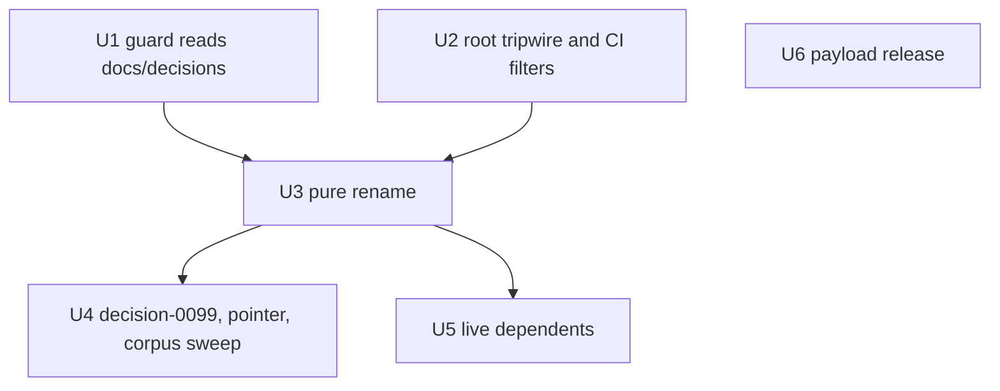

# Move decisions and research under docs - Plan

## Goal Capsule

- **Objective:** Decision records and research notes live under `docs/`, beside the planning artifacts, and every in-repository pointer, guard and CI check that depends on them works at the new location.
- **Means:** `git mv` to `docs/decisions/` and `docs/research/`, a token-only rename sweep, a decision-id guard that reads `docs/decisions/` only, and a root tripwire (KTD1, KTD2, KTD7, KTD8).
- **Authority:** Linear TRL-89 and the maintainer's answers relayed by `trellis-d1`, then the decision records on `main` (`decision-0015`, `0028`, `0040`, `0082`, `0092`, `0097`), then this plan.
- **Stop conditions:** stop and send a DECISION to `trellis-d1` when a record needs more than a path token or a forward pointer, a line this plan classifies turns out to belong to another class, an edit would move a cited line (KTD3), the one-off check shows `0099` taken (KTD11), a merge conflict with TRL-88 needs judgment beyond the rules under Risks & Dependencies, or a change under `plugins/trellis/` goes beyond U6.
- **Execution profile:** test-first for the guard (U1) and the root tripwire (U2); mechanical everywhere else, proved by grep, the Go suite, `npm run quality` and `corpus-reviewer`.
- **Who finishes:** the `trl-89` worker session implements, runs review and repair, and opens a ready-for-review PR. The maintainer merges.

---

## Product Contract

### Summary

Move the 95 decision records and 11 research notes into `docs/decisions/` and `docs/research/`, where Compound Engineering keeps its plans and learnings.
Update every guard, workflow, test, instruction and record that names the old folders, add a test that fails if either folder reappears at the root, and record the move as `decision-0099`.
`eval/` stays at the root and joins `cli-ci`'s path filter.

### Problem Frame

On 2026-09-13 the maintainer decided the governance corpus moves inside `docs/`, the artifact root Compound Engineering uses (`docs_root` is unset, so it is `docs/`, per `decision-0097`).

The move also closes a CI gap. `marketplaceCommands` in `cli/docs_consistency_test.go` walks the whole tree, but `cli-ci`'s path filter has never selected `decisions/`, `research/` or `eval/`, so a PR touching only those skips `build-test`.

`decision-0092` defines a decision-id claim as a file at a `decisions/NNNN-*.md` path, and `.github/scripts/decision-id-guard.sh` enforces that shape. A new location changes the rule, not only its wording.

### Requirements

**Location**

- R1. Every decision record and research note lives under `docs/decisions/` or `docs/research/` with its git history, and no `decisions/` or `research/` directory remains at the repository root. `eval/` stays where it is.

**CI coverage**

- R2. A PR that changes only decision records, research notes or files under `eval/` runs `cli-ci`'s `build-test` job.

**Decision-id guard**

- R3. The guard fails a PR that adds a record at `docs/decisions/NNNN-*.md` whose id is already on the base branch, is claimed by a lower-numbered open PR, or is claimed twice in the PR's own diff.
- R4. Before the move merges, `decision-0099` is shown to be free on `main` and in every open PR, by a one-off check recorded in the PR body's Validation.

**Pointers and records**

- R5. Every mention of this repository's `decisions/` or `research/` folders follows the move per `decision-0015:117-121`, except the keep classes in KTD2.
- R6. `decision-0099` records the move and supersedes `decision-0092` in part, and the superseded record carries the forward pointer.
- R7. Every `file:line` citation into a file this change edits still points at the same content.

**Payload**

- R8. The comment change in `plugins/trellis/hooks/codex-context.mjs` ships as a plugin release.

### Key Decisions

- **The corpus moves under `docs/`.** (session-settled: user-directed — chosen over keeping `decisions/` and `research/` at the repository root: the maintainer wants them beside Compound Engineering's artifacts, and `docs/**` already carries CI coverage.) Governs R1, R2.
- **`eval/` stays at the root.** (session-settled: user-directed — chosen over moving `eval/` under `docs/` as well: `docs/` should not hold runnable code, and `eval/` is mostly a Python harness that `eval-scorecard.yml` runs.) Governs R1, R2.
- **The rename sweep reaches append-only records.** (session-settled: user-directed — chosen over leaving records unswept: the maintainer chose this for PR #306's move of the landing page to `site/`, under `decision-0015:117-121`.) Governs R5.
- **`decision-0092` is superseded in part.** A directive from TRL-89. The guard's claim shape moves to `docs/decisions/NNNN-*.md` and a root path stops claiming (KTD7), which a token sweep of the record's text cannot record. The pointer carries that guard change only (KTD9). Governs R6.

### Scope Boundaries

- No substance edit to any record beyond a path token or a forward pointer.
- No re-wrapping of swept lines (KTD3).
- `corpus-reviewer`'s retirement belongs to TRL-88, which this plan does not touch.
- No change to links outside the repository. GitHub does not redirect moved paths, so Linear links to `blob/main/decisions/…` URLs will break. No inbound links were found in other kodhama repositories.

#### Deferred to Follow-Up Work

- **Other walked-but-unfiltered paths.** About 18 other text files that `marketplaceCommands` reads are outside `cli-ci`'s filter: other workflows, `.github` templates, `core/schemas/`, `cli/testdata/`, the root brief, `.compound-engineering/`, `.devcontainer/`. The maintainer directed a separate Linear issue; `trellis-d1` holds it.
- **Empty-corpus behavior of TRL-88's check.** A check that reads an empty or missing directory passes, so a second merger who misses a path gets no red. `trellis-d1` relayed this to the `trl-88` worker.

---

## Planning Contract

### Key Technical Decisions

- KTD1. **The move lands as a pure rename commit.** Both folders are moved with `git mv` in a commit that changes no content, so `git log --follow` traces each file. The sweep and `decision-0099` land in later commits. Token edits are small, so GitHub still pairs each file as `renamed` at the PR level.
- KTD2. **Sweep classes.** A mention is swept when it names this repository's `decisions/` or `research/` folder or a file in it, in any artifact class, including planning records, tables, quotations and the guard's rule clauses in `decision-0089` and `decision-0092` (KTD9). A mention is kept when it is:
  1. a path in another repository (stewards URLs, kodhama's and wisp's `decisions/`, Math Quest's `decisions/adr-*.md`);
  2. not a path (the `research/…` branch category, "research/UX", "research/feedback doc");
  3. pinned to a commit or to a named past run;
  4. text that describes the move itself: `decision-0097:151`, `decision-0099`, and this plan;
  5. a root `decisions/` or `research/` path named on purpose: the root absence check in `cli/selfapply_test.go` (KTD8), the `decisions/**` and `research/**` entries in `cli-ci.yml` with the comment explaining them, and U1's fixture that shows a root path claims nothing.

  `.claude/agents/corpus-reviewer.md:3` writes "decisions/research" as shorthand for both folders, so it is reworded to name both new paths rather than prefixed. The Appendix lists every kept line.
- KTD3. **Edits keep line numbers.** Records cite fixed lines in files this change edits: `AGENTS.md:36-60`, `.github/workflows/cli-ci.yml:17`, `.github/scripts/decision-id-guard.sh:4,75,77` plus the ranges `decision-0089` and `decision-0092` cite, `.github/workflows/decision-id-guard.yml:4`, `cli/decision_id_guard_test.go:5,120`, `cli/docs_consistency_test.go:35`, `docs/rubrics/artifact-contract.md:5,39,53-57,91`, `README.md` and `plugins/trellis/hooks/codex-context.mjs` at several ranges. Each edit to those files is a same-line substitution, or a rewording that keeps the line count above every cited line. Swept Markdown is never re-wrapped; about 43 lines pass 100 bytes, and nothing enforces a Markdown width. New tests go at the end of their files. `decision-0092` gains one frontmatter line. No `decision-0092:NN` citation exists on `main` at planning time; any that lands before this PR merges shifts by one in this PR (the TRL-88 case under Risks & Dependencies).
- KTD4. **The payload release is a patch.** The only payload edit is a comment, so `plugins/trellis/VERSION` goes from `0.23.0` to `0.23.1`. The `version` fields in both `plugin.json` manifests follow (`TestPluginPackageParity`), and four hashes in `install.sh`'s baked `TRELLIS_BUNDLE_MANIFEST` follow (`TestInstallScriptBundleManifestIsCurrent`): both manifests, `VERSION` and `hooks/codex-context.mjs`.
- KTD5. **`docSurfacesIn` drops its `decisions` and `research` name skips.** After the move they skip nothing, because the top-level `docs/` path skip from `decision-0097` §4 already covers the corpus. The TRL-59 fixture in `TestGuardWalksDoNotReadOtherCheckouts` moves from `decisions/a-record.md` to `docs/decisions/a-record.md`, both the write and the expected key list. It keeps pinning that `marketplaceCommands` reads a record and `docSurfacesIn` does not. The `specs` and `eval` name skips stay.
- KTD6. **`repo-hygiene.yml:4-5` is reworded, not swept.** Its example of paths `cli-ci` omits ("research/, decisions/, eval/") becomes false once `docs/**` and `eval/**` cover them. The parenthetical names paths `cli-ci` still omits, checked against the final filter.
- KTD7. **The decision-id guard reads `docs/decisions/` only.** (session-settled: user-directed — chosen over a guard that reads both `decisions/` and `docs/decisions/`: a root record is the tripwire's job (KTD8), and the move PR's `decision-0099` gets a one-off check (KTD11) instead of a permanent second prefix.) The record match, the prefix strip, the base listing and the messages all move to `docs/decisions/`, each on its existing script line, and the workflow triggers on `docs/decisions/**`. A root `decisions/NNNN-*.md` path claims nothing. On the move PR itself every moved record reads as a new claim against an empty `docs/decisions/` on `main` and is reported free, so that run is not evidence for R4.
- KTD8. **A root tripwire fails the Go suite when `decisions/` or `research/` exists at the root.** (session-settled: user-directed — chosen over no tripwire: a merge that resolves git's directory-rename conflict toward the old path, on TRL-88 or a stale branch, would otherwise put a record outside the `docs/` exemption and outside every check.) It copies the `.grove` absence check (`cli/selfapply_test.go:185-192`, `decision-0076`), and `cli-ci` keeps `decisions/**` and `research/**` in both filters so a PR that recreates either folder runs it.
- KTD9. **Supersession scope.** (session-settled: user-directed — chosen over keeping the 16 guard rule-clause lines in `decision-0089` and `decision-0092` at their root wording and superseding `decision-0089` in part: once the guard reads `docs/decisions/` only, the swept clauses are correct.) The rule clauses are swept like any citation. `decision-0099` supersedes `decision-0092` in part, and the forward pointer's scope comment records the guard change only: a claim is now a file at a `docs/decisions/NNNN-*.md` path, and a root path claims nothing. `decision-0089` is not superseded.
- KTD10. **`decision-0005` stands.** (session-settled: user-directed — chosen over superseding `decision-0005` in part: its Decision fixes only Trellis-core's `core/` namespace, and "keep build methodology at root" in its Consequences describes the reorganization as opposed to `core/`.) `decision-0099` states that `docs/decisions/` stays outside `core/`, and `AGENTS.md:15` takes the path token only.
- KTD11. **The move PR carries a one-off check that `decision-0099` is free.** A maintainer directive, because the guard cannot see `main`'s root ids during the move (KTD7). The check lists every decision id on `main` under both `decisions/` and `docs/decisions/`, and every record path any other open PR adds, copies or renames to under either prefix. Its output goes into the PR body's Validation. It is run once the PR is open, and run again if a PR that adds a record opens before the merge.

### High-Level Technical Design

How the guard classifies a PR file row, today and after U1 (KTD7):

| PR file row | Today | After U1 |
|---|---|---|
| added `docs/decisions/0099-x.md` | no claim | claims `0099` |
| added `decisions/0100-x.md` | claims `0100` | no claim (the root tripwire fails the suite instead) |
| renamed to `docs/decisions/0087-x.md` from `decisions/0087-x.md` (the move) | no claim | claims `0087`; free against an empty `docs/decisions/` on `main` |
| renamed within `docs/decisions/`, id changes | no claim | claims the new id |
| renamed within `docs/decisions/`, same id | no claim | no claim |
| modified or removed record | no claim | no claim |
| added `docs/decisions/README.md` or `docs/decisions/0089.md` | no claim | no claim |
| added `docs/decisions/0088 old.md` (space in path) | no claim | exit 2, could not run |

Base-branch ids come from `decisions/` today, and from `docs/decisions/` after U1.

Unit order:

### Risks & Dependencies

- **TRL-88 edits the same files.** Its PR adds `decisions/0098-*.md` and replaces `corpus-reviewer` with a CI conformance check that reads the corpus; its draft plan deletes `.claude/agents/corpus-reviewer.md`. Whichever PR merges second merges `origin/main` (never rebase) and owns these fixes:
  - moving `0098` to `docs/decisions/` and sweeping its body (git stops with a directory-rename conflict by default);
  - retargeting the other PR's paths: the conformance check, `cli-ci.yml`'s two filter lists, and the rubric's corpus paragraph together with whatever it is paired with on `main`;
  - a second `VERSION` bump if both PRs release, since `release-guard` is required on `main`.
- **If TRL-88 merges first,** U4 and U5 are re-derived against `main` before they start:
  - edits to a file TRL-88 deleted are dropped, and its replacement check runs wherever this plan names `corpus-reviewer`. The reword of `corpus-reviewer.md:3` becomes a modify/delete conflict that resolves toward the deletion;
  - every `decision-0092:NN` citation on `main` shifts by one when `decision-0092` gains its frontmatter line. TRL-88's draft plan cites `decisions/0092:185-192`.
- **The guard cannot vouch for the move PR.** Its run on this PR reports every moved id free against an empty `docs/decisions/` on `main` (KTD7). KTD11's check is the evidence for R4, and the PR body says so.
- **Automated review time.** `claude-code-review.yml:30` caps review at 20 minutes, and a 100-plus-file diff may hit it. A whole-PR review that did not complete is reported in the PR body, not treated as passed.
- **The decision-id guard is advisory.** `main` requires `release-guard`, CodeQL and hygiene, not this check.

### System-Wide Impact

- Record-only and `eval/`-only PRs start running `build-test`, which costs more CI time per corpus PR.
- Agents follow the updated paths in `AGENTS.md`, the rubric and the `corpus-reviewer` charter, which are the corpus pointers they read before editing.
- Plugin consumers receive `0.23.1`, which changes no behavior.

### Sources

- Linear TRL-89 and TRL-88; PR #306, the `site/` move and its sweep precedent.
- `decision-0015:117-121` (rename sweep), `decision-0092` and `decision-0089` (claim rules), `decision-0097` §4-5 (`docs/` record root), `decision-0005` and `decision-0057` (layers), `decision-0040` (partial supersession), `decision-0082` (no `status`).
- `.github/scripts/decision-id-guard.sh:80-81,94-95,220,237,252`; `cli/docs_consistency_test.go:56-72,572-604,629-708`; `cli/artifact_contract_guard_test.go:357-401`; `cli/ci_paths_guard_test.go:82-110`; `cli/selfapply_test.go:185-192`; `install.sh:335-363`; `.github/workflows/release-guard.yml:20-24`.
- No `docs/solutions/` learnings and no Compound Packs exist in this repository.

---

## Implementation Units

### U1. Decision-id guard reads docs/decisions/

- **Goal:** the guard claims and checks records at `docs/decisions/NNNN-*.md`, and a root path claims nothing.
- **Requirements:** R3, R7; KTD7.
- **Dependencies:** none.
- **Files:** `.github/scripts/decision-id-guard.sh`, `.github/workflows/decision-id-guard.yml`, `cli/decision_id_guard_test.go`
- **Approach:**
  1. Move the existing fixture paths and expected messages to `docs/decisions/`, and confirm they fail against the unchanged script.
  2. Add any new scenario below that no existing test covers at the end of the test file, so `:5` and `:120` stay where they are.
  3. In the script, change the record match (`:80`, `:220`), the prefix strip (`:81`), the base listing (`:94-95`), and the messages and comments, each on its existing line. The script keeps its line count.
  4. The workflow trigger becomes `docs/decisions/**`, and its comments are swept.
- **Execution note:** implement test-first. The swept fixtures must fail before the script changes.
- **Patterns to follow:** the fixture-driven cases already in `cli/decision_id_guard_test.go`, which run the production script with injected `GUARD_MAIN_FILES` and `GUARD_PR_FILES`.
- **Test scenarios:**
  - Base holds `docs/decisions/0087-…`, and the PR adds `docs/decisions/0087-a-different-slug.md`: error "already on main", exit 1.
  - Two open PRs add `docs/decisions/0089-…`: the higher-numbered one fails and the lower-numbered one gets a notice.
  - One PR adds `docs/decisions/0090-a.md` and `docs/decisions/0090-b.md`: the duplicate-in-diff error, exit 1.
  - A rename within `docs/decisions/` that changes the id (`renamed docs/decisions/0090-new.md docs/decisions/0086-old.md`) claims `0090`.
  - A slug-only rename within `docs/decisions/` claims nothing.
  - Non-record names at the new prefix (`docs/decisions/README.md`, `docs/decisions/0089.md`, `docs/decisions/089-three-digits.md`): no claim.
  - A root path (`added decisions/0087-z.md`) claims nothing, even when `docs/decisions/0087-…` is on the base.
  - A space in a record path (`docs/decisions/0088 old.md`): exit 2.
  - A spaced non-record file inside `docs/decisions/` in another PR: no abort.
  - `TestDecisionIDGuardWorkflowRunsTheScript` still passes.
- **Verification:** the Go guard tests pass; the script's line count is unchanged; the statements `decision-0092` cites by script line (`:75`, `:77`, `:233-243`, `:288-299`, `:311`) are still on those lines.

### U2. Root tripwire and CI filter coverage

- **Goal:** `cli-ci` runs on PRs touching the corpus, `eval/` or a recreated root folder, and the suite fails when root `decisions/` or `research/` exists.
- **Requirements:** R1, R2, R7; KTD8.
- **Dependencies:** none. The tripwire stays red until U3.
- **Files:** `cli/selfapply_test.go`, `.github/workflows/cli-ci.yml`
- **Approach:**
  1. Add `eval/**`, `decisions/**` and `research/**` to both filter lists, keeping the lists identical.
  2. Add an absence check for root `decisions/` and `research/`, modeled on the `.grove` check, whose message names `decision-0099`.
  3. Update the filter-contract comment at `cli-ci.yml:11-28` on its existing lines, and keep line 17's `.github/scripts/**` clause (`decision-0092:209`).
- **Execution note:** write the absence check before U3, and confirm it fails naming both root folders.
- **Patterns to follow:** `cli/selfapply_test.go:185-192` and the `.grove/**` filter entry it justifies.
- **Test scenarios:**
  - Root `decisions/` present: the test fails naming it.
  - Root `research/` present: the test fails naming it.
  - Both absent after U3: passes.
  - `TestCIPathFilterCoversEveryPathTheSuiteReads` passes on both triggers with the new reads.
- **Verification:** the CI paths guard passes, and `cli-ci.yml:17` still carries the clause `decision-0092` cites.

### U3. Move the corpus with history

- **Goal:** all 95 records and 11 notes sit under `docs/decisions/` and `docs/research/`.
- **Requirements:** R1; KTD1.
- **Dependencies:** U1, U2.
- **Files:** `decisions/` becomes `docs/decisions/`, and `research/` becomes `docs/research/`.
- **Approach:** a pure rename commit with no content change (KTD1).
- **Test expectation:** none -- a pure rename. U2's absence check turns green, and every file pairs as a 100%-similar rename.
- **Verification:** no root `decisions/` or `research/`; 106 renames; `git log --follow` on a moved record reaches its first commit.

### U4. decision-0099, the forward pointer and the corpus sweep

- **Goal:** the corpus and the planning records point at the new location, and `decision-0099` records the move and what it supersedes.
- **Requirements:** R5, R6, R7; KTD2, KTD3, KTD9, KTD10.
- **Dependencies:** U3.
- **Files:**
  - Create `docs/decisions/0099-the-governance-corpus-lives-under-docs.md`.
  - Pointer and sweep: `docs/decisions/0092-a-claim-is-a-new-record-path.md`.
  - Sweep only: records `0006`, `0014`, `0015`, `0041`, `0042`, `0044`, `0066`, `0075`, `0076`, `0079`, `0081`, `0082`, `0083`, `0084`, `0085`, `0087`, `0089` and `0090` under `docs/decisions/`; `docs/research/0009-issue-triage.md`; `eval/experiments/README.md`; the four plans and three specs under `docs/superpowers/` that mention the folders.
- **Approach:**
  1. Write `decision-0099` with Context, Decision and Consequences (artifact contract check 6), no `status`, and frontmatter shaped like `decision-0097`'s. It covers the location, `eval/` staying, the guard's claim shape (KTD7), the root tripwire (KTD8), the one-off check (KTD11), the supersession scope (KTD9), why `decision-0005` stands (KTD10), and the sweep's keep classes (KTD2).
  2. Add `superseded_in_part_by: [decision-0099]` to `decision-0092`, with the clause-level scope in a trailing comment as `decision-0089:6` does.
  3. Prefix `docs/` on every swept line, including the guard rule clauses in `decision-0089` and `decision-0092` (KTD9). Leave the folder mentions on every Appendix line unswept, and re-wrap nothing.
- **Test expectation:** none -- records only. The sweep grep and `corpus-reviewer` in the Verification Contract prove this unit.
- **Verification:** `corpus-reviewer` reports no FAIL on the changed records other than the pre-existing one on `decision-0044:5`; the sweep grep matches the Appendix.

### U5. Live dependents outside the corpus

- **Goal:** instructions, the rubric pair, the profile, tests and workflow comments name the new location.
- **Requirements:** R5, R7; KTD2, KTD3, KTD5, KTD6.
- **Dependencies:** U3.
- **Files:** `AGENTS.md`, `README.md`, `docs/rubrics/artifact-contract.md`, `.claude/agents/corpus-reviewer.md`, `profiles/trellis-self.md`, `cli/docs_consistency_test.go`, `cli/surface_matrix_guard_test.go`, `.github/workflows/repo-hygiene.yml`
- **Approach:**
  1. `AGENTS.md:15,29,31,51,103` take the path token. `:106` is a branch category and stays.
  2. `README.md:301-302` change both link text and link target.
  3. `artifact-contract.md:20` and `corpus-reviewer.md:22` change in the same commit. `corpus-reviewer.md:3` is reworded (KTD2).
  4. `profiles/trellis-self.md:80,85,87` take the path token; `:85` quotes the `AGENTS.md:103` rule.
  5. `docs_consistency_test.go` follows KTD5, and its comments at `:29-33`, `:63-71` and `:629-638` are updated on their existing lines.
  6. The comment at `surface_matrix_guard_test.go:284` takes the path token, and `repo-hygiene.yml:4-5` follows KTD6.
- **Test scenarios:**
  - `TestCorpusReviewerCharterMatchesRubricCorpus` passes with `docs/decisions/` and `docs/research/` on both sides, and fails if only one side changes.
  - `TestGuardWalksDoNotReadOtherCheckouts`: `marketplaceCommands` reads `README.md` and `docs/decisions/a-record.md`, and `docSurfacesIn` reads only `README.md`.
  - `TestDocsClaimOnlyRealCommands` passes, and the walk still finds at least 20 surfaces.
  - The `AGENTS.md` routing statements in `cli/selfapply_test.go` are still found.
- **Verification:** the Go suite passes, and each KTD3 anchor in these files reads the same content.

### U6. Release the payload comment change

- **Goal:** the swept comment at `codex-context.mjs:14` ships as `0.23.1`.
- **Requirements:** R8; KTD4.
- **Dependencies:** none.
- **Files:** `plugins/trellis/hooks/codex-context.mjs`, `plugins/trellis/VERSION`, `plugins/trellis/.claude-plugin/plugin.json`, `plugins/trellis/.codex-plugin/plugin.json`, `install.sh`
- **Approach:** a token edit on line 14 only, since records cite `codex-context.mjs:14-31`, `:30` and later ranges. Then update `VERSION`, both manifests, and the four hashes in the bundle manifest. If `main`'s `VERSION` has moved past `0.23.0` by merge time, the release takes the next patch after it, with manifests and hashes regenerated.
- **Test scenarios:**
  - Before the hashes move, `TestInstallScriptBundleManifestIsCurrent` fails naming the four changed files, and afterwards it passes.
  - `TestPluginPackageParity` passes with `0.23.1` in `VERSION` and both manifests.
  - The Codex hook tests pass, because a comment changes no behavior.
  - `prettier --check` and `eslint` pass on the hook.
- **Verification:** the Go suite and `npm run quality` pass, and `release-guard` reports a payload change with a newer `VERSION`.

---

## Verification Contract

| Check | Command or method | Proves |
|---|---|---|
| Typecheck | `cd cli && go build ./... && go vet ./...` | the Go changes compile |
| Go suite | `cd cli && go test -count=1 ./...` | R1-R3, R7 and R8: guard, tripwire, filters, doc walks, rubric pair, payload |
| Quality bar | `npm run quality` from the repository root | shell and JS lint, file size, todo markers, plugin smoke. If `shellcheck` is missing locally, the PR body says so and CI runs it. |
| Sweep completeness | repo-wide grep for `decisions/` and `research/`, keeping only hits not preceded by `docs/` | R5: the remaining hits are exactly the Appendix entries (KTD2 class 5 included), `decision-0099` and this plan |
| Cited lines | compare each KTD3 anchor before and after | R7 |
| One-off `0099` check (KTD11) | list decision ids on `origin/main` under `decisions/` and `docs/decisions/`, and every open PR's added, copied or renamed record paths under either prefix, excluding this PR | R4: no other holder of `0099`; the output goes into the PR body's Validation |
| Corpus conformance | the repository's `corpus-reviewer` agent over `docs/decisions/`, `docs/research/` and `core/` | the artifact contract, with no FAIL other than the pre-existing one on `decision-0044:5` |
| CI on the PR | `cli-ci`, `decision-id-guard`, `release-guard`, `repo-hygiene` | R2, R3 and R8 on GitHub. The guard's log on this PR lists every moved id as free, which is expected (KTD7) and not evidence for R4. |

---

## Definition of Done

- **Global:**
  - R1-R8 hold, and every check in the Verification Contract passes.
  - The PR body's Validation shows the one-off check for `decision-0099`.
  - The PR body lists the calls made without asking, the Appendix's kept lines as final, and any unapplied review findings.
  - No leftover code from abandoned approaches remains in the diff.
  - The plan is committed with the work (`decision-0097`).
- **U1:** the guard tests pass with `docs/decisions/` fixtures and the script's line count is unchanged.
- **U2:** the root tripwire and both filter lists are in place, and the CI paths guard passes.
- **U3:** the rename commit holds only renames.
- **U4:** `decision-0099` and its pointer are written, the sweep is complete against the Appendix, and `corpus-reviewer` reports no FAIL other than the pre-existing one on `decision-0044:5`.
- **U5:** every live dependent is updated, and each cited anchor is unchanged.
- **U6:** the payload is released as `0.23.1`, or the next patch after `main`'s version at merge time, with manifests and install hashes current.

---

## Appendix

### Kept lines

Line numbers are before this change; `decision-0092`'s shift by one once its frontmatter pointer lands. U4 re-verifies them, and the PR body carries the final list.

| Class (KTD2) | Lines |
|---|---|
| Another repository | `decision-0044:82,91,206,210,237`; `decision-0062:15,17`; `decision-0064:14,31,33`; `decision-0066:15`; `agentic-dev-meta-layer-brief.md:317,319` |
| Not a path | `decision-0047:56,68`; `AGENTS.md:106`; `agentic-dev-meta-layer-brief.md:204` |
| Pinned to a commit or run | `decision-0015:113` (commit `3f27a29`); `decision-0089:200` (the `git ls-tree` loop that allocated `0089`); `decision-0092:223` (output of the #280 run); `decision-0092:224` (the offline check before #280) |
| Describes the move | `decision-0097:151`; `decision-0099`; this plan |
| Root path named on purpose | the root absence check in `cli/selfapply_test.go`; the `decisions/**` and `research/**` entries in `cli-ci.yml` and the comment explaining them; U1's fixture that shows a root path claims nothing |

`.claude/agents/corpus-reviewer.md:3` is reworded rather than kept (KTD2).
`.compound-engineering/config.yaml:97` and `config.example.yaml:97` ("research/plan-write") are prose and are not path mentions.
