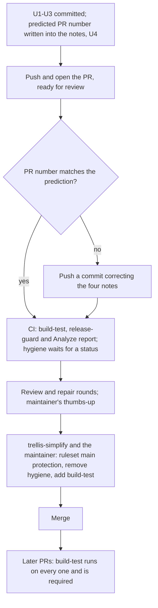

# cli-ci runs on every pull request - Plan

## Goal Capsule

- **Objective:** Every pull request and every push to `main` runs `cli-ci`'s full Go suite and quality checks, and a pull request cannot merge while they fail. No list of paths has to be kept in step with what the tests read.
- **Means:** delete `cli-ci`'s path filter, the guard that polices it and `repo-hygiene.yml`, and have `build-test` replace `hygiene` as the required check, an edit `trellis-simplify` makes with the maintainer (R8).
- **Product authority:** the maintainer's answers of 2026-09-14 on TRL-96 and on TRL-98's dated-note rule, relayed by `trellis-simplify` (Key Decisions). Linear TRL-96 in the Simplify Trellis project, idea 6 of the ideation. The project's other ideas are not active scope here.
- **Open blockers:** none.
- **Stop conditions:** ask `trellis-simplify` before a change that alters consumer-visible behaviour or the approved design, before resolving a merge conflict that needs judgment about another idea, and before changing a profile verdict, C1, C2 or confidence value rather than its evidence.
- **Execution profile:** deletions and prose. Proof is the Go suite and the conformance tests staying green, and the pull request's own CI showing `build-test` running with `hygiene` pending (AE3).
- **Who finishes:** `simplify-6` implements, reviews and opens a ready-for-review pull request. `trellis-simplify` swaps the required check with the maintainer, who merges.

---

## Product Contract

### Summary

`cli-ci`'s `build-test` job runs on every pull request and every push to `main`, and becomes a required status check in place of `hygiene`.
The path filter, `cli/ci_paths_guard_test.go`, the filter assertions in `cli/selfapply_test.go` and `.github/workflows/repo-hygiene.yml` are deleted.
Live text that describes `build-test` as path-scoped or advisory is corrected, and the four decision records this change makes out of date each get a dated note.

### Problem Frame

`build-test` is the only job that runs `go test`, and it runs only when a changed path matches a 28-entry filter that the workflow repeats for each trigger. The workflow calls that filter "a coverage contract, not a convenience" (`.github/workflows/cli-ci.yml:11`). If the filter omits a file the suite reads, a pull request that touches only that file skips the test that pins it, and nothing turns red.

The contract has broken three times. The filter first omitted the decision-id guard's script and workflow, then `core/invariants/` and `profiles/`, a gap PR #278 showed live (`cli/ci_paths_guard_test.go:10-16`). The third, filed as TRL-92, is `marketplaceCommands` in `cli/docs_consistency_test.go`, which reads every text file in the tree. The guard sees only paths spelled out in the test code, so it cannot catch a file that walk reads and the filter misses.

Keeping the contract costs a 437-line test that parses every test file's syntax tree to find the paths it reads. The guard also shapes how other tests are written: `cli/corpus_conformance_test.go:43-46` says its paths are `../` literals so the guard can see them. The filter also keeps entries for retired directories (`.grove/**`, `decisions/**`, `research/**`) whose only job is to run the tests that fail if those directories come back.

The filter is also why a second workflow exists. `repo-hygiene.yml` runs the file-size and TODO scripts "deliberately outside cli-ci" (`.github/workflows/repo-hygiene.yml:3-8`), because the filter skips some pull requests. `build-test` already runs both scripts through `npm run quality`. The `hygiene` job is a required check on `main` and `build-test` is not, so a failing test or conformance finding does not block a merge.

Removing the filter costs CI time on pull requests that skip `build-test` today. A run takes 87 to 119 seconds, and 3 of the last 30 merged pull requests (#301, #285, #282) did not run it.

### Requirements

**When CI runs**

- R1. `cli-ci` runs `build-test` on every `pull_request` event and every push to `main`, with no `paths` or `paths-ignore` filter.
- R2. `build-test`'s steps do not change: `npm run quality` (including the file-size and TODO scripts), then Go build, vet, test and the coverage floor.

**What is retired**

- R3. `.github/workflows/repo-hygiene.yml` is deleted. Its two scripts keep running through `npm run quality`, in `build-test` and locally.
- R4. `cli/ci_paths_guard_test.go` is deleted. No new check asserts that `cli-ci` has no path filter.
- R5. The assertion in `cli/selfapply_test.go` that `cli-ci`'s filter lists `AGENTS.md`, `CLAUDE.md` and `.trellis/**` is deleted.
- R6. The tests that fail when `.grove/`, a root `decisions/` or a root `research/` exists are kept, and their comments stop citing the filter or the guard.

**Required checks and the merge**

- R7. After this work merges, `main`'s ruleset requires `build-test` in place of `hygiene`, and `release-guard`, `Analyze (go)` and `Analyze (javascript)` stay required. The pull request body states the edit exactly: ruleset **main protection** (id 18526979), rule *Require status checks to pass*, remove `hygiene`, add `build-test`.
- R8. `trellis-simplify` makes the ruleset edit with the maintainer, after the maintainer's 👍 on the pull request and immediately before the merge. This work never edits the ruleset, and it treats the pull request's pending `hygiene` status as expected rather than as a CI failure.

**What depends on the change**

- R9. Per `decision-0028`, the same pull request corrects every live text outside `docs/decisions/` and `docs/plans/` that says `build-test` runs only on pull requests touching certain paths, says it is not required, or cites the guard or `repo-hygiene.yml`. `AGENTS.md`'s *"a red is a signal, not a merge block"* is rewritten to say a red `build-test` blocks the merge. The known sites are listed under Sources.
- R10. Each decision record this change makes out of date gets exactly one dated note, directly under its title heading: `decision-0097`, `decision-0098`, `decision-0099` and `decision-0100`. The note text is under Dated Notes, with `#<n>` replaced by this pull request's number once it exists, and the pull request body lists the four notes.
- R11. Nothing under `plugins/trellis/` changes, so `plugins/trellis/VERSION` does not move.
- R12. The pull request closes TRL-92 and says that its criterion *"A guard fails if that stops being true"* was dropped on purpose.
- R13. Apart from the notes in R10, no file under `docs/decisions/` and no earlier plan under `docs/plans/` is edited. This plan is the one addition under `docs/plans/`, and planning enriches it in place.

### Key Decisions

- **`build-test` replaces `hygiene` as the required check.** It runs everything `hygiene` ran plus the tests, so the job that must pass is the job that runs every check. (session-settled: user-approved — chosen over keeping a `hygiene` job inside `cli-ci`, or requiring neither: one required job that runs every check.) Governs R3, R7, R9.
- **Swap the check, then merge at once.** (session-settled: user-approved — chosen over two pull requests or an edit before the pull request opens: the only open pull request, #311, already runs `build-test`, so the swap blocks nothing.) Governs R8.
- **No decision record.** Every path the records say must run `build-test` still runs it, and the one statement that becomes false left the requirement to a repository setting. (session-settled: user-approved — chosen over `decision-0103` with `superseded_in_part_by` pointers on `decision-0098` and `decision-0099`: TRL-98 decides how out-of-date records are marked.) Governs R10, R13.
- **Each out-of-date record gets one dated note under its title.** The note says what no longer holds and where the current behaviour is stated, and the record's body stays as written. (session-settled: user-directed — chosen over a successor record or a forward pointer: the maintainer's rule on TRL-98 for a change that writes no record.) Governs R10.
- **The `decision-0100` note also corrects its line citation into `decision-0098`.** The `decision-0098` note moves that record's body down two lines, which would leave `decision-0100`'s citation `decision-0098:133-134` pointing at the wrong text, and the note is the one place in `decision-0100` this change writes. The maintainer confirmed on 2026-09-14 that a pull request adding a note corrects the live line citations into that record. Governs R10.
- **No guard against a filter coming back.** With no filter there is nothing left to drift, and adding one back is a visible workflow edit. (session-settled: user-approved — chosen over a few-line check that fails on a re-added filter: the project retires guards whose subject is gone.) Governs R4, R12.
- **The absence tests for retired directories stay.** They guard the retirements in `decision-0076` and `decision-0099` point 3, not the filter, and retiring guards in general is idea 4's work. Governs R6.

### Acceptance Examples

- AE1. **Covers R1, R7.** **Given** the ruleset edit is made and this work is merged, **when** a pull request changes only `LICENSE`, **then** `build-test` runs and the pull request cannot merge until it passes.
- AE2. **Covers R2, R3.** **Given** this work is merged, **when** a pull request adds a tracked file over the size limit, **then** `build-test` fails and the merge is blocked.
- AE3. **Covers R8.** **Given** this pull request is open and `hygiene` is still required, **then** `hygiene` shows as waiting for a status while `build-test`, `release-guard` and both `Analyze` checks report results.
- AE4. **Covers R6.** **Given** this work is merged, **when** a pull request adds a root `decisions/` directory, **then** `build-test` runs and `cli/selfapply_test.go` fails.

### Success Criteria

- Outside `docs/decisions/`, `docs/plans/` and `docs/ideation/`, no file names `ci_paths_guard_test.go`, `repo-hygiene.yml` or a `cli-ci` path filter.
- `build-test` passes on the pull request, and the corpus conformance tests pass with the dated notes and the `profiles/` and `docs/rubrics/` edits in place.
- Excluding this plan, the diff is a net deletion of roughly 500 lines.

### Dated Notes

Governed by R10. Each note is one line, directly under the record's title heading, and moves the record's body down two lines.

- `docs/decisions/0097-compound-engineering-replaces-superpowers.md`:

  > **Dated note, 2026-09-14 — TRL-96 (PR #<n>):** Point 4's "`cli-ci`'s path filter keeps `docs/**` for it" no longer holds, because `cli-ci` has no path filter and runs `build-test` on every pull request. `.github/workflows/cli-ci.yml` states the current triggers.

- `docs/decisions/0098-artifact-conformance-is-a-ci-check.md`:

  > **Dated note, 2026-09-14 — TRL-96 (PR #<n>):** Five statements no longer hold: point 1's "that touches a corpus path, the rubric, the fixtures or the check itself"; point 5's "requires `release-guard`, `Analyze (go)`, `Analyze (javascript)` and `hygiene`", "does not block a merge" and "`build-test`, the job that runs the check, is not among them"; and the Consequences' "`cli/ci_paths_guard_test.go` forces the filter to cover every path the suite reads", "the `cli-ci` filter mirror it, and guards pin both" and "TRL-92's other paths, and its root fix, stay open there". `cli-ci` has no path filter, that guard is deleted, and `build-test` runs on every pull request as a required check on `main`, so no file the suite reads can skip it, as `.github/workflows/cli-ci.yml` and `AGENTS.md`'s conformance bullet state.

- `docs/decisions/0099-the-governance-corpus-lives-under-docs.md`:

  > **Dated note, 2026-09-14 — TRL-96 (PR #<n>):** Point 3's "`cli-ci`'s filters keep `decisions/**` and `research/**`", point 5 and the TRL-92 item under the Consequences' *Not decided here* no longer hold, because `cli-ci` has no path filter. Every pull request now runs `build-test`, including one that recreates a root `decisions/` or `research/`, as `.github/workflows/cli-ci.yml` states.

- `docs/decisions/0100-the-artifact-contract-is-repository-internal.md`:

  > **Dated note, 2026-09-14 — TRL-96 (PR #<n>):** The Consequences' "`cli-ci` no longer selects them" no longer holds, because `cli-ci` has no path filter, and their citation `decision-0098:133-134` now reads `decision-0098:135-136` after that record's own dated note. `.github/workflows/cli-ci.yml` states the current triggers; nothing reads `core/rubrics/` or `core/fixtures/`, so a branch that recreates them still lands unchecked.

Text left as written because it describes past work: the plans under `docs/plans/`, including their line citations `decision-0097:151` and `decision-0098:132-134`, which the notes shift by two lines; the ideation document under `docs/ideation/` (added by #311); the filter edits described in the Consequences of `decision-0098`, `decision-0099` and `decision-0100`; and `decision-0092:209`'s dated inventory, which cites `cli-ci.yml:17`.

### Scope Boundaries

- Path filters on other workflows (`decision-id-guard.yml`, `eval-scorecard.yml`, `pages.yml`) stay. The decision-id guard retires under idea 1.
- Retiring other guards and reviewing the 90% coverage floor belong to idea 4.
- Writing the dated-note rule into `AGENTS.md` belongs to `simplify-1a`.
- Requiring any other check (`decision-id`, `parity`, the Claude review) is not part of this work.
- CI speed-ups such as caching or splitting `npm run quality` are out of scope, because a run takes about two minutes.

### Dependencies / Assumptions

- GitHub runs a `pull_request` workflow from the merge commit (`GITHUB_SHA` is "Last merge commit on the `GITHUB_REF` branch"), so this pull request runs no `hygiene` job. AE3 confirms it on the pull request itself.
- GitHub lets a check be required only if it *"completed successfully in the chosen repository during the past seven days"*. `build-test` has passed on #311 and on pushes to `main`.
- A pull request still open at the swap whose last push skipped `build-test` needs a new merge commit: a push, or GitHub's *Update branch*. Re-running an old run reuses the old commit and cannot clear the pending check. Today there is no such pull request.
- The four notes, applied on 2026-09-14 at `83adb8c` with a placeholder pull request number, passed `go test -count=1 -run 'TestCorpusConform|TestArtifactContract' .` and the full `cli` suite, and were then reverted.

### Outstanding Questions

**Deferred to Planning**

- The exact rewording of each site under Sources, including how much of `cli-ci.yml`'s header comment survives. KTD1, KTD4 and KTD7 settle the intent; the words are written in U1 and U3.

### Sources

- Ideation: https://linear.app/kodhama/document/ideation-simplifying-the-trellis-repository-0fdee58072c3 (idea 6). Linear TRL-96, TRL-92 and TRL-98.
- Retired: `.github/workflows/cli-ci.yml:11-38`, `.github/workflows/repo-hygiene.yml`, `cli/ci_paths_guard_test.go`, `cli/selfapply_test.go:233-249`.
- Sites to correct (R9, R6): `AGENTS.md:103-105`; the header comment of `.github/workflows/cli-ci.yml`; `docs/rubrics/artifact-contract.md:38-39`; `core/README.md:18`; `cli/README.md:26-27`; `profiles/trellis-self.md:54`, `:79`, `:103`, `:104`, `:106`; `cli/corpus_conformance_test.go:4-5` and `:43-46`; `cli/artifact_contract_guard_test.go:725-727`; `cli/selfapply_test.go:191-196`.
- Kept as is: `cli/codex_hook_test.go:1251-1268` reads `cli-ci.yml` for its Node version and `go test` line, not the filter. The `../` literals in `corpusRoots` stay, because `loadCorpus` stats them from `cli/` (`cli/corpus_conformance_test.go:437`).
- Ruleset: `gh api repos/kodhama/trellis/rulesets/18526979`, read 2026-09-14. No bypass actors. Required contexts: `release-guard`, `Analyze (go)`, `Analyze (javascript)`, `hygiene`.
- GitHub docs: https://docs.github.com/en/pull-requests/collaborating-with-pull-requests/collaborating-on-repositories-with-code-quality-features/troubleshooting-required-status-checks (a skipped required workflow's checks *"stay in a 'Pending' state and block merging"*) and https://docs.github.com/en/actions/reference/workflows-and-actions/events-that-trigger-workflows (`pull_request`).

---

## Planning Contract

Product Contract preservation: two additions during planning, no scope change. The `decision-0100` Key Decision gains the maintainer's 2026-09-14 confirmation that a note corrects the live line citations into its record, and Outstanding Questions points at KTD1, KTD4, KTD7, U1 and U3.

### Key Technical Decisions

- KTD1. **`cli-ci.yml` loses both `paths:` lists and the header paragraphs that describe them.** The opening paragraph, which says what `build-test` runs and why, stays. The two paragraphs that call the filter a coverage contract and name the guard go, because they describe nothing that remains. Governs R1, R2.
- KTD2. **The guard and the filter assertion are deleted outright, not rewritten.** `cli/ci_paths_guard_test.go` has no identifier another file uses, and the block in `cli/selfapply_test.go` that reads `cli-ci.yml` exists only to check filter entries. Nothing replaces either, per the Key Decision against a filter guard. Governs R4, R5.
- KTD3. **The `../` literals in `corpusRoots` and the unprefixed seed root in `cli/artifact_contract_guard_test.go` keep their code; only their comments change.** `loadCorpus` stats the roots from `cli/`, so the prefix is a real path, and `contractRootSpelling` spells both forms alike, so the seed needs no prefix. The guard was one reason for each form, never the only one. Governs R6.
- KTD4. **`profiles/trellis-self.md` is repaired under its own convention: a fifth dated repair note in the header, and the affected rows repaired in place.** The fourth repair note's "runs on every PR touching the corpus" (`profiles/trellis-self.md:54`) stays as written, because repair notes are dated history; the fifth repair note corrects it. Row `inv-gate-at-handover` quotes the old `AGENTS.md` sentence and rests `default-on-but-skippable` on "none blocks a merge". After this change the check does block a merge, so the row re-argues from the gate itself: independent review fires by default and does not block, and the check is supporting evidence only (`decision-0098` point 7). No verdict, C1, C2 or confidence value changes. Governs R9.
- KTD5. **The pull request number in the notes is predicted, then confirmed.** Just before opening the pull request, the implementer reads the repository's highest issue or pull request number and writes the next number into the four notes. After opening, the implementer confirms the number and pushes a correction commit if another pull request took it. The alternative, opening with a placeholder and always pushing a second commit, runs CI and the automated review twice on every path. Governs R10.
- KTD6. **No failing test is written first.** The approved design adds no check (R4), so there is no new behaviour for a test to pin. Proof is the suite and the conformance tests staying green after the deletions, a local mutation check that the kept absence tests still fail (U2), and the pull request's own CI (AE3).
- KTD7. **`AGENTS.md` keeps its conformance bullet's structure and changes two clauses.** "on every PR that touches them" becomes "on every PR", and the "not a required status check … a signal, not a merge block" sentence becomes one saying `build-test` is required on `main`, so a red blocks the merge. The two judgment rules under the bullet do not change. Governs R9.

### High-Level Technical Design

The merge lifecycle crosses three actors and a repository setting, and its order is the one thing that can strand the pull request.

### Assumptions

- The local `npm run quality` cannot run in full here: ShellCheck is not installed and `node_modules` is absent. `npm ci` restores the JavaScript checks, Go 1.27.1 satisfies staticcheck, and `lint:shell` runs only in CI. The pull request body says so.
- The ruleset accepts `build-test` as a required context, since the job has passed in this repository within the past seven days. `trellis-simplify` performs the edit, so a refusal surfaces there.
- `simplify-1a` and `simplify-2` may merge first and touch `AGENTS.md` or `profiles/trellis-self.md`. A conflict is resolved by merging `origin/main` into this branch. A conflict that needs judgment about another idea's design goes to `trellis-simplify` (Stop conditions).
- Editing an existing record does not claim a decision id: the decision-id guard counts added, copied and renamed record paths only (`decision-0092`, `decision-0099` point 2).

### Sequencing

U1, U2 and U3 are independent and can land in any order. U4 comes last, because its pull request number is read just before the pull request opens (KTD5).

---

## Implementation Units

### U1. Run cli-ci on every pull request and retire repo-hygiene.yml

- **Goal:** `build-test` runs on every pull request and every push to `main`, and the separate hygiene workflow is gone.
- **Requirements:** R1, R2, R3; KTD1.
- **Dependencies:** none.
- **Files:** `.github/workflows/cli-ci.yml` (modify), `.github/workflows/repo-hygiene.yml` (delete).
- **Approach:**
  1. Remove the `paths:` line under `pull_request` and under `push`, keeping `branches: [main]` on `push`.
  2. Keep the opening header paragraph and remove the two paragraphs about the path filter and its guard (KTD1).
  3. Delete `repo-hygiene.yml`. Leave the job steps untouched (R2).
- **Patterns to follow:** `codeql.yml`'s unfiltered `pull_request` and `push` triggers.
- **Test expectation:** none -- workflow configuration. `cli/codex_hook_test.go` still reads `cli-ci.yml` for its Node version and `go test` line and must keep passing. AE3 is proven on the pull request's CI; AE1 holds only after the ruleset swap and the merge.
- **Verification:** `cli-ci.yml` contains no `paths` key, and the full `cli` suite passes.

### U2. Retire the path guard and the filter assertions

- **Goal:** No test reads or polices a `cli-ci` path filter, and the kept tests explain themselves without it.
- **Requirements:** R4, R5, R6; KTD2, KTD3, KTD6.
- **Dependencies:** none.
- **Files:** `cli/ci_paths_guard_test.go` (delete); `cli/selfapply_test.go`, `cli/corpus_conformance_test.go`, `cli/artifact_contract_guard_test.go` (modify).
- **Approach:**
  1. Delete `cli/ci_paths_guard_test.go`.
  2. In `cli/selfapply_test.go`, delete the block that reads `cli-ci.yml` and checks its trigger sections, and reword the comment above the root `decisions/` and `research/` absence checks so it no longer cites the guard or the filter.
  3. In `cli/corpus_conformance_test.go`, drop "that touches it" from the header comment and replace the `corpusRoots` comment's guard sentence with the path reason (KTD3).
  4. In `cli/artifact_contract_guard_test.go`, keep only the `contractRootSpelling` reason in the seeded-root comment.
- **Execution note:** Confirm the kept absence tests still bite: create an empty root `decisions/` locally, see the self-apply test fail, then remove it.
- **Patterns to follow:** `cli/selfapply_test.go`'s header, which records a guard deleted with its subject (`decision-0071`).
- **Test scenarios:**
  - Covers AE4. With an empty `decisions/` directory at the repository root, the self-apply test fails naming `decision-0099`; after removing it, the test passes.
  - With an empty `.grove/` directory at the root, the self-apply test fails naming `decision-0076`.
  - The full `cli` suite passes with `cli/ci_paths_guard_test.go` deleted, and staticcheck, run by `npm run quality`, reports no unused code.
  - `gofmt -l cli/` lists nothing.
- **Verification:** `git grep` finds no `ci_paths_guard` or `ciPathFilter` identifier under `cli/`, and build, vet and test pass.

### U3. Correct the live text that calls build-test path-scoped or advisory

- **Goal:** Every live instruction, product note and profile row states that `build-test` runs on every pull request and blocks a merge when red.
- **Requirements:** R9; KTD4, KTD7.
- **Dependencies:** none. The profile row quoting `AGENTS.md` takes KTD7's wording, so write `AGENTS.md` first within this unit.
- **Files:** `AGENTS.md`, `docs/rubrics/artifact-contract.md`, `core/README.md`, `cli/README.md`, `profiles/trellis-self.md` (modify).
- **Approach:**
  1. `AGENTS.md`: the conformance bullet's two clauses (KTD7).
  2. `docs/rubrics/artifact-contract.md`: the repository note says `cli-ci` runs the Go test on every pull request. The Corpus paragraph and the check text stay untouched, since the artifact-contract guard pins them.
  3. `core/README.md`: "on every PR that touches it" becomes "on every PR".
  4. `cli/README.md`: CI runs build, vet and test on every PR, still pointing at `cli-ci.yml`.
  5. `profiles/trellis-self.md`: add the fifth dated repair note (2026-09-14, TRL-96) and extend the header's repair dates. Repair Delivery and rows `inv-gate-at-handover`, `inv-independent-judgment` and `inv-bounded-context` in place (KTD4).
- **Patterns to follow:** the fourth repair note in `profiles/trellis-self.md`: what changed, which rows, and "No verdict, C1, C2 or confidence value changed."
- **Test scenarios:**
  - `TestCorpusConform` and `TestArtifactContract` pass with the rubric and profile edits.
  - The `inv-gate-at-handover` row's quotation of `AGENTS.md` matches the new sentence character for character.
- **Verification:** each site under Sources reads as R9 requires, except `profiles/trellis-self.md:54`, which sits in the fourth repair note that KTD4 keeps as dated history and which the fifth repair note corrects. No row's verdict, C1, C2 or confidence cell changed.

### U4. Add the dated notes to decisions 0097 to 0100

- **Goal:** Each record this change makes out of date carries one note saying what no longer holds and where the current behaviour is stated.
- **Requirements:** R10, R13; KTD5.
- **Dependencies:** U1, U2, U3 committed, since the pull request number is read just before the pull request opens.
- **Files:** `docs/decisions/0097-compound-engineering-replaces-superpowers.md`, `docs/decisions/0098-artifact-conformance-is-a-ci-check.md`, `docs/decisions/0099-the-governance-corpus-lives-under-docs.md`, `docs/decisions/0100-the-artifact-contract-is-repository-internal.md` (modify).
- **Approach:**
  1. Read the next pull request number (KTD5).
  2. Insert each note from Dated Notes, verbatim with that number, as one line directly under the title heading, followed by a blank line.
  3. Confirm `decision-0098:135-136` holds the sentence the `decision-0100` note cites.
  4. After the pull request opens, confirm its number matches, or push the correction.
- **Test scenarios:**
  - `TestCorpusConform` and `TestArtifactContract` pass with the four notes.
  - Each record's diff adds exactly two lines and deletes none.
- **Verification:** the notes' pull request number equals the opened pull request's number.

---

## Verification Contract

| Gate | Command or evidence | Proves |
|---|---|---|
| Go build and vet | `cd cli && go build ./... && go vet ./...` | U2 left no dangling code |
| Go suite | `cd cli && go test -count=1 ./...` | U1 to U4 keep every test green, `codex_hook_test.go` included |
| Conformance | `cd cli && go test -count=1 -run 'TestCorpusConform\|TestArtifactContract' .` | U3 and U4's corpus edits conform |
| Absence tests | a temporary root `decisions/` or `.grove/` fails the self-apply test | R6, AE4 |
| Formatting | `gofmt -l cli/` is empty | U2 |
| Quality bar | `npm ci && npm run quality`, with `lint:shell` left to CI | R2's checks still pass |
| Retired names | `git grep` for `ci_paths_guard`, `repo-hygiene` and a `cli-ci` path filter, excluding `docs/decisions/`, `docs/plans/` and `docs/ideation/` | Success Criteria |
| Pull request CI | `build-test` green, `hygiene` waiting for a status | AE3, R1 |

---

## Definition of Done

- R1 to R13 hold, and the Success Criteria are met.
- Every unit's Verification passes, and the Verification Contract's gates are green or, for `lint:shell`, named in the pull request body as CI-only.
- The pull request is open and ready for review, titled `TRL-96: …`. Its body carries the ruleset edit (R7), the four dated notes with the maintainer's TRL-98 ruling of 2026-09-14 as their authority, the text left as written, `Closes TRL-92` with the dropped guard criterion (R12), and the calls made without asking.
- The pull request number in the four notes matches the opened pull request.
- No experimental or abandoned code remains in the diff.
