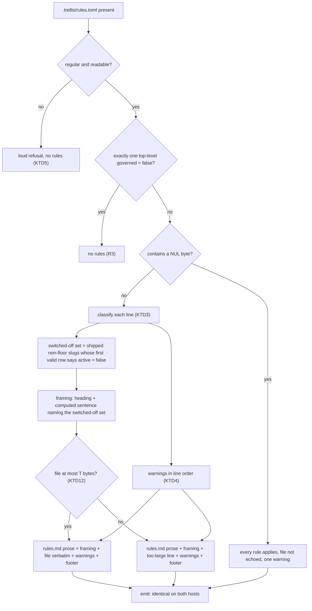
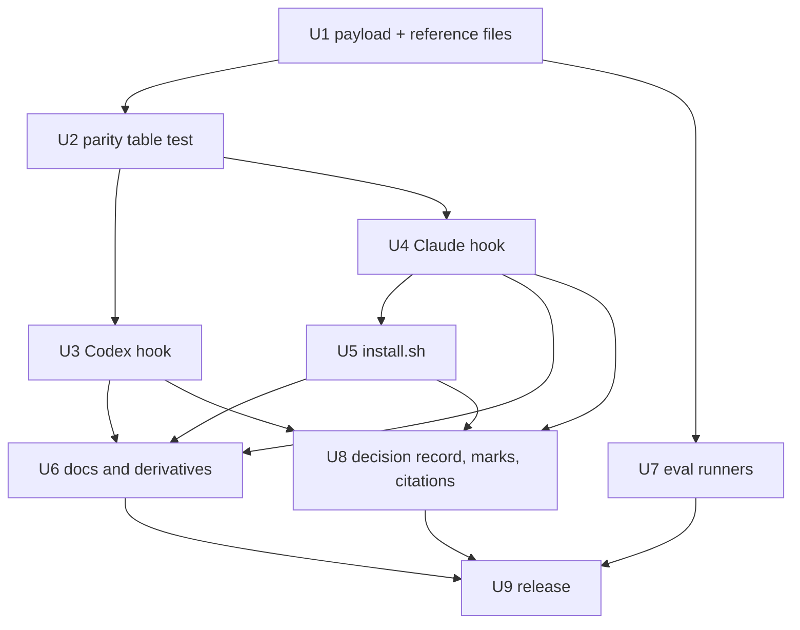

# Rule configuration shrinks to an opt-out list - Plan

## Goal Capsule

- **Objective:** A project that adopts Trellis configures it by naming only the rules it switches off, and a plugin release that adds, renames or retires a rule can never cost that project its rules or rewrite its file.
- **Means:** `.trellis/rules.toml` keeps its `[rules]` rows, but only a row set `active = false` has any effect. `strictness` and `seeded_from` are ignored, the posture presets and posture headers stop shipping, and both hooks' reconcile, quarantine and rewrite machinery retires. No existing file has to change. A decision record named by date and slug records the change (KTD13).
- **Product authority:** the maintainer (`gundisalwa`), through the Simplify Trellis project, issue TRL-97; requirements approved 2026-09-14. Idea 5 (one delivery path) and idea 3 (claim only what ships, including the eval) are not active scope.
- **Execution profile:** one PR on `feature/trl-97-rules-opt-out-list`, one plugin release. `ce-work` builds the units in order; the session that owns TRL-97 runs review, the PR and CI.
- **Stop conditions:** evidence that a session-settled decision cannot work stops the build and goes to the Simplify Trellis orchestrator as a question. So does any review finding whose fix would change consumer-visible behaviour or the approved design.
- **Open blockers:** none.

---

## Product Contract

### Summary

`.trellis/rules.toml` keeps its `[rules]` rows, and only a row set `active = false` has any effect. A rule with no row applies, and `active = true` rows, `strictness` and `seeded_from` are ignored. `governed = false` still opts a project out. The posture presets and headers retire with the hook machinery that kept every file's rows in step with the plugin, and every existing file keeps working unchanged.

### Problem Frame

The file carries three things, and only the rows decide which rules apply.

A valid `strictness` selects one sentence in the delivered text. An invalid one makes Codex refuse the whole file and load no rules, while Claude reads it as adaptive. `decision-0033:28-30` records that the lean "is descriptive, not enforced (nothing acts on it yet)", and the two shipped presets are byte-identical in all sixteen rows. `seeded_from` has no behavioural reader anywhere.

The rows must list every rule the plugin ships, so every catalog change leaves every existing file out of step. `decision-0083:25` records the cost: "A single unmatched row cost all sixteen rules, every session, until a human edited the file." The repair added reconciliation, quarantine and a write-back mandate to both hooks. It then needed seven guards against a broken payload driving that repair (`decision-0083`'s entry-point table), a byte-budget degradation path on Codex, and cross-host parity tests. On 2026-09-14, four of the nine Kodhama consumer files were still on the fourteen-row set and reconciled every session.

What does work is switching a rule off. `research-0012` measured it on one rule and one task: control 95%, row off 0%, a +95-point effect. No known consumer uses it yet, since every known Kodhama file switches every rule on, but it is the one lever worth keeping.

### Key Decisions

- **Sparse rows, not a new list.** (session-settled: user-directed — chosen over a `disabled` list with a transition reader and follow-on migration PRs, or both forms permanently: every existing file stays valid under every installed plugin version, so no repository migrates.) The maintainer accepted the cost: existing Kodhama files keep rows that no longer do anything, and this repository's file keeps `strictness = "firm"` while its sessions receive the "By default" sentence. Governs R1, R2, R4, R16, R17.
- **Every project receives the "By default" posture sentence.** (session-settled: user-directed — chosen over "Firmly" for everyone, dropping the sentence, or keeping `strictness` as an optional key: eight of the nine known consumers already receive it, so no untested wording reaches them; this repository moves from "Firmly".) Governs R14.
- **`governed = false` stays.** (session-settled: user-directed — chosen over retiring it or replacing it with new syntax: a decline stays a committed, reviewable project fact, as `decision-0070` ruled.) Governs R3, R7, R9.
- **The records this change makes out of date carry one dated note each, not new pointers.** (session-settled: user-directed — chosen over new `superseded_in_part_by` pointers: the maintainer's convention for records a change makes out of date.) The maintainer set the scope at every record the change makes untrue, fourteen in all, over the five first named. A record whose every Decision point retires is retired in full and carries `superseded_by` instead, as his answer on TRL-98 keeps it; the orchestrator reconciled the two answers that way. Governs R24, R25.
- **A decision record is written.** The maintainer's rule for plugin behaviour changes (relayed from TRL-98) asks for a record when a wrong call could silently stop rules reaching consumers' sessions. This change replaces the logic that decides which rules reach every session on both hosts, and deletes the reconciler and the guards `decision-0083` and `decision-0084` built around it against silent blackouts; a wrong deletion there is exactly that failure. Governs R23.
- **The file stays the adoption marker wherever adoption has no other sign.** Where the plugin's files live outside the repository — a user-scope install, or a marketplace install at project scope, whose files sit in the user's plugin cache — and on Codex, a project adopts by having the file (`decision-0070` D4 and D7, `decision-0077`). "No file means every rule applies" holds only where adoption is otherwise evidenced: a plugin vendored into the repository, or a curl install that seeds the file. Governs R8, R9, R10, R11.
- **A bad entry costs that entry, never the session.** A floor or an unknown slug set `active = false`, a malformed row, or an unknown key is ignored with a warning, and the file's valid rows keep their effect; only a file that cannot be parsed at all degrades to every rule applying. A declared `governed = false` still means no rule applies. This follows `decision-0083` §5: over-governance the session announces beats under-governance nobody sees. Governs R5, R6, R7.
- **Nothing reconciles, so nothing is rewritten.** With a missing row meaning active and an unknown row ignored, a file cannot fall out of step with the plugin. Governs R15.
- **New files hold only what has effect.** (session-settled: user-approved — chosen over new files carrying every shipped rule as an `active = true` row: such a file is only written when a repository adopts Trellis, and no older install loses rules silently on it.) A file written from now on carries no `strictness`, no `seeded_from` and no `active = true` rows. Installed plugin versions are pinned per checkout and update independently of this release, and older ones read such a file differently: measured on 2026-09-14, 0.6.0 and older refuse it loudly and load no rules, and 0.7.0 to 0.23.x keep its `active = false` rows but reconcile it and instruct writing every row back. Full `active = true` rows would read cleanly on 0.6.0 and later but not on 0.3.0 or 0.5.0, and would keep spreading inert rows. Governs R9, R11.
- **The annotation mechanism stays; filtering switched-off rules out of the text is idea 5's.** The hook keeps delivering the full rules text with the activation rule and the rows, the shape `research-0012`'s annotation arm measured. Governs R13.
- **Legacy delivery shapes keep their frozen text and their file.** A vendored overlay, an inline managed block, or a rendered file from an older installer carries rules text that applies a rule only when its row says `active = true`, so a project on one of those shapes must keep a full row set. Nothing here writes into those projects; idea 5 migrates those shapes.

### Requirements

**The file**

- R1. `.trellis/rules.toml` keeps its `[rules]` table of `slug = { active = … }` rows, and a row set `active = false` switches that rule off.
- R2. A rule with no row applies, a rule whose row says `active = true` applies, and an empty file means every shipped rule applies.
- R3. `governed = false` keeps its meaning on both hosts: no rule applies, floor rules included, whatever else the file holds (`decision-0070` D5). It is recognized as both hooks recognize it today: exactly one uncommented top-level `governed` assignment above any table header, read before the rest of the file.
- R4. `strictness` and `seeded_from` are ignored without comment.
- R5. A row that sets a slug the installed plugin does not ship to `active = false` is ignored, and the session is told which slug and that another plugin version may ship it.
- R6. A floor row set `active = false` is ignored, and the session is told floor rules cannot be switched off.
- R7. A malformed row, or a key the format does not define, is ignored with a warning, and the file's other rows keep their effect; a file that cannot be parsed at all delivers every rule and the session is told why. A file that declares `governed = false` falls under R3 in either case.

**Adoption**

- R8. With the plugin vendored under the project's own `.claude/skills/` and no file, every rule applies (`decision-0070` D3, unchanged).
- R9. With the plugin's files outside the repository and no file, the hook keeps announcing and loading nothing (`decision-0070` D4, `decision-0077`); on acceptance the agent writes a file holding only what has effect, and on decline one holding `governed = false`.
- R10. On Codex, the file's presence keeps locating and adopting the project (`decision-0070` D7).
- R11. `install.sh` seeds a missing file holding only what has effect, and leaves an existing file untouched.

**Delivery**

- R12. Given the same file, both hooks deliver the same rules text, the same set of rules switched off, and the same warnings.
- R13. The delivered rules text states the activation rule once: a rule applies unless its row says `active = false`, and floor rules always apply while the project is governed.
- R14. Every project receives the "By default" posture sentence, whatever `strictness` its file carries.
- R15. Neither hook reconciles, quarantines, or tells the agent to rewrite `.trellis/rules.toml`.

**Existing files**

- R16. Every existing `.trellis/rules.toml` stays valid as it is, and nothing in this change asks a project to edit it.
- R17. This repository's own `.trellis/rules.toml` is left unchanged: `strictness = "firm"` and sixteen `active = true` rows, all now inert.

**What retires, and what follows it**

- R18. The posture presets and posture variants stop shipping: `rules-a.toml` and `rules-b.toml` go, `trellis-a.md` and `trellis-b.md` become one header carrying the "By default" sentence, and the per-posture inline blocks become one of each.
- R19. Every reader of a retired file and every restatement of the old semantics moves in the same change: the payload generator, `install.sh` with its bundle manifest and rendered footer, both hooks' remedy messages, the Codex fallback block, the remove skill, both READMEs, the landing page, the catalog's row-set note and its mirror, and `scripts/plugin-smoke.mjs`. Where those consumer docs explain the rows, they say that removing rows from a file is safe only once every install that opens the repository runs this release.
- R20. Tests that guard retired behaviour retire with it, including the check that compares the rules payload against the default rows preset and the guard that read that preset as a project's rows. Tests that guard behaviour that survives (adoption, the opt-out, the rules payload's own terminator and slug list, the read gateway, delivery shapes) are re-pointed rather than dropped.
- R21. The two eval runners that read retired payload files still run against the inputs they were designed for.
- R22. The change ships as one plugin release, with `plugins/trellis/VERSION` bumped.

**Records**

- R23. The change's decision record records what it retires and why.
- R24. Each record this change makes out of date is marked, and none gets a new `superseded_in_part_by`: `decision-0033`, `0051`, `0053`, `0058`, `0068`, `0070`, `0072`, `0074`, `0078`, `0083`, `0084`, `0086`, `0087` and `0088`. A record whose every Decision point retires carries `superseded_by` naming the change's record; `decision-0086` and `decision-0088` are the candidates, and `decision-0088` stays partial if its D3 or D4 still describes what `install.sh` reads. Every other record gets one dated note directly under the title, below any notes already there, pointing at the change's record, in the shape `> **Dated note, YYYY-MM-DD — TRL-<n> (PR #<n>):** <what is no longer true, naming the point or sentence>. <where the current behaviour is stated now>.` The PR body lists each record marked and whether it was marked in full or in part.
- R25. Live line citations into those records (in other live records, code comments, tests and `AGENTS.md`) are corrected in the same change; citations in plans and dated inventories stay as they are, such as `decision-0081`, which dates its own citations. A grep on 2026-09-14 counted twenty across ten files before that exclusion.

### Acceptance Examples

- AE1. **Covers R1, R2.** **Given** a file whose only row is `inv-minimal-first = { active = false }`, **then** every other shipped rule applies and `inv-minimal-first` does not.
- AE2. **Covers R3, R7, R13.** **Given** a file holding `governed = false`, alone, beside a key the format does not define, or beside a row that does not parse, **then** no rule loads, floor rules included, and no delivered text says floor rules apply.
- AE3. **Covers R5.** **Given** a row `inv-not-a-rule = { active = false }`, **then** every rule applies and the session is told `inv-not-a-rule` is not a rule this plugin ships.
- AE4. **Covers R6.** **Given** a row `floor-transparency = { active = false }`, **then** every rule applies, `floor-transparency` included, and the session is told floor rules cannot be switched off.
- AE5. **Covers R7.** **Given** a malformed row `inv-bounded-context = off` beside `inv-minimal-first = { active = false }`, **then** every rule except `inv-minimal-first` applies and the session is told which row is malformed.
- AE6. **Covers R9.** **Given** the plugin's files outside the repository and no file, **then** no rules load and the session is told Trellis will govern once accepted; **after** acceptance the file carries no `strictness`, no `seeded_from` and no `active = true` rows.
- AE7. **Covers R2, R15.** **Given** a plugin release that adds a rule, and a project whose file has fourteen `active = true` rows, **then** the next session is governed by every rule including the new one, and nothing asks for the file to change.
- AE8. **Covers R4, R14, R17.** **Given** this repository's file, with `strictness = "firm"` and sixteen `active = true` rows, **then** every rule applies under the "By default" sentence and nothing is said about either key.

<!-- ce-section: work-relationships -->
### How This Work Fits Together

This plan covers idea 2 of the Simplify Trellis ideation. The breakdown below is the project's current understanding, not a committed roadmap.

- Idea 5, one delivery path and a hook that checks adoption and prints the rules minus opt-outs — **depends on** these semantics.
- Idea 3, claim only what ships — **shares** the two eval experiments this change touches; retiring or tagging them is idea 3's.
- Idea 1a, decision records become rare — **shares** the record convention this change follows: one new record named by date and slug, dated notes, no new pointers (R23 to R25).

### Scope Boundaries

- Tidying the inert rows and keys out of existing files, this repository's included. Nothing owes it. Removing rows is safe only once every install that opens a repository runs this release: installs are pinned per checkout, and plugin 0.6.0 and older refuse a file with missing rows.
- Filtering switched-off rules out of the delivered text, and consolidating delivery onto one path.
- Migrating legacy delivery shapes: vendored overlay, flat overlay, inline managed block, rendered file from an older installer.
- Retiring the eval experiments, the C1/C2 dials, `profiles/` or `core/lexicon.md`.
- Rewriting hook comments beyond the sections this change deletes (idea 7).

#### Deferred to Follow-Up Work

- **CR-only line endings split `governed = false` differently on the two hosts**, and a file with invalid UTF-8 but no NUL byte can reach Claude's JSON escaper raw. Both predate this change. A Linear issue in the Simplify Trellis project is filed when the PR opens and linked from its body; that issue is the consumer.

### Dependencies / Assumptions

- `research-0012` measured an `active = false` row, the form this change keeps, on one rule and one task; that it holds for other rules is assumed.
- A renamed rule's opt-out lapses: the old slug's row is ignored with R5's warning, and the new slug applies until the project adds a row for it. No slug has been renamed so far.
- The Kodhama repositories are the known consumers: nine on 2026-09-14, with wisp and review-kit since being retired by the maintainer. No record counts installs outside them.
- Installed plugin versions are pinned per checkout and update independently of this release. On 2026-09-14 the Codex install ran 0.23.0 and the user-scope Claude install 0.22.0; at about 20:11 UTC that day the trellis, math-quest, stewards and kodhama checkouts were updated to 0.23.1 at project scope, taking effect as their sessions restart.
- Codex remains carried rather than supported (`plugins/trellis/README.md:137-141`); R12 keeps the two hosts in step regardless.

### Sources / Research

- Consumer scan (`gh api`, 2026-09-14): nine `kodhama/*` repositories carried `.trellis/rules.toml`; every row was active; `trellis` was `firm` and the rest `adaptive`; four were on fourteen rows; none used a legacy delivery shape.
- Installed versions (2026-09-14, before about 20:11 UTC): `~/.claude/plugins/installed_plugins.json` pinned per checkout path; the trellis, stewards, kodhama and wisp main checkouts ran 0.6.0 as marketplace installs at project scope with files in the user's plugin cache; math-quest 0.8.0; review-kit 0.11.0; worktrees ranged from 0.3.0 to 0.23.1; the user-scope Claude install ran 0.22.0; `~/.codex/plugins/cache/kodhama/trellis/` held only 0.23.0. Shipped slug counts: 0.3.0 fourteen, 0.5.0 fifteen, 0.6.0 onward sixteen.
- Measurements (2026-09-14): against a file holding only `[rules]`, and one whose only row is `inv-minimal-first = { active = false }`, the cached 0.6.0 `staleness.sh` refuses and loads no rules; the `staleness.sh` and `codex-context.mjs` on `main` at 83adb8c keep the `active = false` row, reconcile, and instruct writing the rows back.
- Record sweep (fresh-context agent, 2026-09-14; entries spot-checked against the records by this session and by the orchestrator): the fourteen records in R24 carry decision or consequence text this change makes untrue; `decision-0077` and the research records do not.
- `docs/decisions/0033-park-seed-and-custom-postures.md`, `0053-live-rows-assembly-retires.md`, `0070-adoption-is-the-consent-act-not-installation.md`, `0077-silence-is-not-an-adoption-act.md`, `0083-rules-toml-reconciles-itself.md`, `0084-codex-reaches-reconciliation-parity.md`.
- `docs/research/0012-annotation-vs-absence-mechanism.md:148-164`.
- `plugins/trellis/hooks/staleness.sh` path B and its reconciler; `plugins/trellis/hooks/codex-context.mjs` `parseRulesToml` and `reconcileRows`; `cli/payload.go`, `cli/apply.go`, `cli/onboarding.go`; `install.sh`.

---

## Planning Contract

**Product Contract preservation:** changed: R23, R24 and the Goal Capsule Means — the record is named by date and slug rather than `decision-0102`, per the maintainer's TRL-99 ruling relayed by the orchestrator; no scope change. The questions the requirements deferred to planning are answered in KTD1 (delivery), KTD9 (new file content), KTD3 (duplicate rows), KTD5 (what cannot be parsed) and KTD14 (eval inputs), and their list is removed. A Deferred to Follow-Up Work entry is added under Scope Boundaries.

### Key Technical Decisions

- KTD1. **Both hooks frame the project's file identically and name the rules it switches off.** The framing is two lines on both hosts: the heading `## Project rule activation`, then one computed sentence naming the rules this file switches off, or saying it switches none off. Below them comes the file verbatim, the row form `research-0012` measured, unless it is larger than the shared threshold in KTD12. The computed sentence tells the model the effective result even when an ignored row still reads `active = false`, and it makes each host's classification observable to U2. Parity under R12 means identical rules prose, framing lines, file bytes and warning text on the plugin-native path. Governs R12, R13.
- KTD2. **The activation rule lives once, in `rules.md`.** `rulesAuthorityHeader` (`cli/apply.go`) is reworded to say a rule applies unless its row says `active = false`, floor rules always apply while the project is governed, and nothing else in the file changes which rules apply. The hooks and the installer's rendered footer add framing only and drop today's second authority sentence. The last clause covers an inert `strictness` without naming it (AE8). The reword is argued in the record, because the old sentence is `research-0012`'s tested wording. Governs R4, R13, R14.
- KTD3. **One row-classification contract, implemented in both hooks and pinned by one table test.**
  - Strip a line-1 UTF-8 BOM and trailing CR; classify under `LC_ALL=C` on Claude.
  - Classify each line as blank, comment, table header, top-level assignment, or row.
  - Rows count only under `[rules]`. A trailing comment on the header is allowed, and a second `[rules]` header continues the table with a warning.
  - Any other section header warns once; the lines under it are ignored and draw no warnings of their own. A row above every table header is a row outside `[rules]` and warns.
  - A row matches today's Codex row pattern (slug `(inv|floor)-[a-z-]+`, value `{ active = true|false }`, optional trailing comment). Anything else under `[rules]` is malformed.
  - The first row for a slug decides; later rows for it are ignored with a warning.
  - Top-level keys: `strictness` and `seeded_from` are ignored silently (R4); `governed = true` is silent; a `governed` line that does not opt out (repeated, a value other than `true`/`false`, or under `[rules]`) warns; any other key warns.
  - Unknown slugs are found against the slug set derived from `rules.md`; floors are found by the `floor-` prefix (`TestCodexDerivesItsSlugSetFromThePayload` forbids quoted slug literals in the Codex hook).
  - Governs R1, R2, R4, R5, R6, R7, R12.
- KTD4. **Warnings are part of the injected context on both hosts, in file line order, and bounded.** Codex also mirrors them to `systemMessage`, because nothing in the repository establishes that the Codex model reads `systemMessage`.
  - A warning names the line number and the slug, or the key, or the entry type when there is neither (a section header, a malformed row with no slug, a NUL byte). It never quotes the raw line, so non-ASCII bytes cannot make the hosts diverge.
  - A warning for an ignored entry that sets a shipped slug to `active = false` (a floor row, a later duplicate, a row outside `[rules]`) is always named, once per slug. That list is bounded by the shipped slug set.
  - Other warnings name at most five entries and count the rest.
  - The warnings sit inside the assembled context that the byte budget measures. On Claude they are printf format literals inside the `payload="$( … )"` block, so the destructive-instruction scan covers them.
  - Governs R5, R6, R7, R12.
- KTD5. **"Cannot be parsed at all" is a readable file containing a NUL byte, checked after `governed = false`.** The `governed = false` read runs first on both hosts, as it does today, so an opted-out file with a NUL byte still loads no rules. Otherwise the file is not echoed, every rule applies, and one warning says why. An unreadable or non-regular file keeps today's loud refusal on both hosts, because a `governed = false` the hook cannot read cannot be ruled out. Governs R3, R7.
- KTD6. **The no-file adoption path is an explicit branch.** With the bundle vendored under the project's `.claude/skills/` and no file, the Claude hook delivers every rule with no row block and never reads `$toml`. Today that path reads `reference/rules-b.toml` as the project's rows, and a leftover positional read would turn every such project into a refusal. Governs R8, R15.
- KTD7. **R12 is scoped to both hooks on the plugin-native path.** On Claude's stand-down paths (vendored overlay, rendered `.claude/rules/trellis.md`, inline managed block) the host imports or embeds the file and no hook classifies it. The Codex vendored branch appends the project's frozen overlay prose, the two framing lines of KTD1 and the file. Its frozen text still says a rule applies only when its row says `active = true`, but the computed sentence states which rules are actually off, so a file missing a row is not silently under-governed now that reconciliation no longer adds the row. The docs and the record name the frozen-text shapes as never-trim. Governs R12, R19.
- KTD8. **One header and one inline block ship.** `payloadFiles()` writes `trellis.md`, `block-inline.md` and `block-inline-head.md`; `Profile`, `allProfiles`, `renderRulesToml` and the unused `strengthLine` cases go. The inline block drops its embedded `## Active rows` section, since nothing needs seeding and the managed inline shape is retired for new installs. `payload --out` never deletes, so the eight retired files are removed by hand. Governs R14, R18.
- KTD9. **A new file is a comment line and an empty `[rules]` table.** (session-settled: user-approved — chosen over new files carrying every shipped rule as an `active = true` row: such a file is only written when a repository adopts Trellis, and no older install loses rules silently on it.) The comment names the opt-out form. `install.sh` writes those bytes literally, the hook's accept instruction quotes the same bytes, `scripts/plugin-smoke.mjs` writes the same file, and one test pins install.sh's seed to the hook's accept text (`decision-0028`, a guard per pair). Governs R9, R11.
- KTD10. **Remedies carry opt-outs forward, not posture.** Every hook and installer message that today says to copy a preset now says to write the new file plus any `active = false` rows the old shape carried, and keeps its confirmation clause. The installer's static-conflict branch says to migrate the legacy shape and re-run, never to write the file by hand, because under frozen text a sparse file governs only the floors. Governs R9, R19.
- KTD11. **The installer keeps rendering over an unreadable file, and says so.** `decision-0088` D3's render-and-disclose behaviour stands. The disclosure moves off the retired posture branch and says that no opt-out in the file could be honoured and every rule now applies. So `decision-0088` gets a dated note, not `superseded_by`. Governs R11, R24.
- KTD12. **A shared size threshold keeps an oversized file from costing the session.** Both hosts echo the file only when it is at most T bytes. Above T they deliver the two framing lines, the warnings and one line saying the file is too large to show, so the computed sentence still states which rules are off. U3 fixes T from the measured Codex headroom so that the context with a T-byte file and the largest warning block stays within `MAX_CONTEXT_BYTES` (9500 B). The byte caps on both hosts remain runaway guards whose refusal no project file can reach, and the over-budget provenance degradation retires with provenance. Governs R12, R15, R16.
- KTD13. **The record is `docs/decisions/<date>-rule-rows-only-switch-rules-off.md`, id `decision-<date>-rule-rows-only-switch-rules-off`, dated the day it is written.** (session-settled: user-directed — chosen over `decision-0102`: new decision records are named by date and slug, and a numbered record written after the method changed would be the only one.) `decision-0086` gets `superseded_by` naming it, because every one of its points retires; the other thirteen get dated notes. The decision-id guard reads a date-named record as a claim on id `2026`; it is advisory, and no open PR adds a `2026-*` record today. If it goes red on the PR, the PR gets a reply saying so and the record keeps its name. Governs R23, R24.
- KTD14. **Eval runners get their own inputs.** `eval/experiments/annotation-vs-absence/run.sh` reads the payload files it needs as they stood at its recorded run commit `2ec7da8`, which carries every file it reads. `eval/experiments/does-trellis-help/run.sh` measures what Trellis ships, and its recorded results predate the retired files, so it reads the new single header and inline block. Governs R21.
- KTD15. **Test guards are re-anchored, never loosened.**
  - The payload printf scan keeps at least five real printfs: the rules prose, the two framing lines of KTD1 and the two footers. The warning templates join them.
  - A mutation subtest injects a destructive verb into a warning template on each host and requires the scan to fail.
  - The payload-name floor keeps at least ten names.
  - The gateway want list drops `preset` and `toml` only where those reads no longer exist.
  - The two existing mutation subtests re-anchor on a surviving payload instruction.
  - `codexPayloadFunctions` names the new framing-and-warning builder in place of the retired mandate functions.
  - Every `payloadFiles()[name]` fixture lookup goes through a helper that fails on a missing name, so a retired key cannot silently yield an empty "every rule applies" file.
  - Governs R20.
- KTD16. **The release is 0.23.1 → 0.24.0.** A consumer-visible semantics change takes the minor number. `VERSION` and both `plugin.json` files move together, and the `install.sh` bundle manifest is regenerated after every other bundle edit. Governs R22.

### High-Level Technical Design

Session start with a file present, on the plugin-native path, is the same on both hosts after this change. The adoption checks, stand-down paths and payload reads ahead of it are unchanged.

How each line class resolves (directional; the table test in U2 is the executable statement):

| Line | Effect | Warning |
|---|---|---|
| blank, or starts with `#` after trimming | none | none |
| `[rules]` (first) | opens the table | none |
| `[rules]` again | table continues | yes |
| any other `[section]` header | lines under it ignored | once, on the header |
| lines under a foreign section | none | none |
| top-level `strictness`, `seeded_from` | none | none |
| top-level `governed = true` | none | none |
| top-level `governed` that does not opt out | none; project stays governed | yes |
| other top-level key | none | yes |
| row above every table header | none | yes, always named if it sets a shipped slug `false` |
| `slug = { active = false }`, shipped, not a floor, first for the slug | rule switched off | none |
| same, but slug not shipped | none | yes (R5) |
| same, but a floor | none | yes (R6), always named |
| `slug = { active = true }` | none | none |
| row repeating an earlier slug | ignored | yes, always named if it sets a shipped slug `false` |
| anything else under `[rules]` | ignored | yes (R7) |

Unit dependencies:

U2, U3 and U4 are one red-to-green stretch: U2 lands a failing table, and U3 and U4 turn it green.

### Assumptions

- Nothing in the repository shows whether Codex puts `systemMessage` in front of the model, so rule warnings go in the injected context (KTD4).
- Five named entries, plus every ignored `active = false` row for a shipped slug, are enough for any realistic file; the rest are counted.
- T can be set high enough that every known consumer file (about 1.1 KB) is echoed verbatim on both hosts; U3 measures it and the record states it (KTD12).
- None of the known consumers is on a legacy delivery shape, per the 2026-09-14 scan, so the frozen-text contradiction in KTD7 has no current victim.
- The decision-id guard stays advisory until TRL-99 removes it, so a date-named record does not block a merge (KTD13).
- A slug, once retired, is never reused. A stale `active = false` row for a retired slug would otherwise switch off a new rule that reused the name; the record states the rule (U8).

### Risks & Dependencies

| Risk | Mitigation |
|---|---|
| Test churn hides a lost assertion: a retired payload key silently yields an empty "every rule applies" fixture | KTD15's failing lookup helper; U2's table asserts outcomes, not just absence of errors |
| The two hooks drift on a line class | U2 runs both hooks on every row of one table and compares the computed sentence, file segment and warning text |
| A rewrite drops a remedy's confirmation clause, or a warning template carries a destructive verb | the destructive-instruction and deletion scans keep covering both channels, with the new mutation subtests (KTD15) |
| simplify-1a's TRL-98 or TRL-99 PRs land first and touch `AGENTS.md` or the same records | merge `origin/main` into the branch and resolve; a conflict that needs judgement about 1a's design goes to the orchestrator |
| Legacy-shape projects trim rows after reading the new docs | U6 names those shapes as never-trim in both READMEs, the landing page and the record (KTD7) |
| Pinned older installs meet a minimal new file | measured and settled; stated in the record (KTD9) |

### System-Wide Impact

- **Consumers:** every project on the plugin-native path gets the new activation text, the "By default" header, a sentence naming its switched-off rules, and warnings for bad entries; existing files keep working unedited.
- **Both hosts:** the Claude and Codex hooks change together and are pinned to each other (U2).
- **Curl installs:** `install.sh` seeds a smaller file and renders one header; an older rendered file keeps its frozen text until re-run.
- **Eval:** annotation-vs-absence stays reproducible at its recorded commit; does-trellis-help measures the shipped payload.
- **Records corpus:** one new record, one `superseded_by`, thirteen dated notes and the citation corrections run through corpus conformance.

### Deferred to Implementation

- Exact framing, warning and too-large wording, pinned once by U2's table.
- The value of T and the measured Codex headroom (U3).
- Helper and function names in both hooks and in the tests.
- Line-level retire-or-re-point calls for each existing test, starting from the buckets named in U3 to U6.

---

## Implementation Units

### U1. Payload generator and shipped reference files

- **Goal:** the payload ships one "By default" header, one inline block and the reworded activation rule, and no posture presets.
- **Requirements:** R13, R14, R18, R19 (Codex fallback block), R20; KTD2, KTD8.
- **Dependencies:** none.
- **Files:**
  - `cli/payload.go`, `cli/apply.go` (modify)
  - `cli/onboarding.go`, `cli/onboarding_test.go` (delete)
  - `cli/payload_test.go`, `cli/codex_hook_test.go` (bootstrap contract tests only), `cli/selfapply_test.go` (modify)
  - `plugins/trellis/reference/` (regenerate; remove `rules-a.toml`, `rules-b.toml`, `trellis-a.md`, `trellis-b.md`, `block-inline-a.md`, `block-inline-a-head.md`, `block-inline-b.md`, `block-inline-b-head.md`)
- **Approach:**
  1. Replace the posture loop in `payloadFiles()` with fixed `trellis.md`, `block-inline.md` and `block-inline-head.md` entries; delete `Profile`, `allProfiles` and `renderRulesToml`, and make the header renderer take no profile.
  2. Reword `rulesAuthorityHeader` and `rulesReadoutHeader` per KTD2.
  3. Drop the rows section from the inline block and make its tail say activation follows the rows in `.trellis/rules.toml`.
  4. Rewrite `renderCodexBootstrap` item 2 to say: only a row set to false switches a rule off, a rule with no row applies, top-level keys other than `governed` and unrecognized entries are ignored, `governed = false` opts out, and the file is never rewritten. Name neither retired key, avoid the word "reconciled", and write the row value as a boolean placeholder so the literals `active = true` and `active = false` stay out of the block.
  5. Regenerate `plugins/trellis/reference/` and delete the eight retired files.
- **Execution note:** start by changing `TestPayloadFileSet` and the authority-wording test to the new names and sentence, and watch them fail.
- **Patterns to follow:** the fixed entries at the top of `payloadFiles()`; `TestVendoredPayloadIsCurrent` as the freshness check.
- **Test scenarios:**
  - `TestPayloadFileSet` lists exactly `block-claude.md`, `block-codex.md`, `block-inline.md`, `block-inline-head.md`, `block-inline-tail.md`, `checksums`, `invariants.md`, `rules.md`, `trellis.md`, `version`.
  - The header contains "**How strictly to follow them:** **By default**" and no "**Firmly**".
  - `rules.md` opens with the new activation sentence, and neither `rules.md` nor any header contains "ONLY if its row says `active = true`".
  - The inline block is head + readout + tail with no `## Active rows` section and no `strictness`, `seeded_from` or row line.
  - `block-codex.md` contains no `strictness`, `seeded_from`, "reconciled" or "commented out", contains no literal `active = true` or `active = false`, and still carries every slug exactly once and the governed opt-out phrase.
  - `TestVendoredPayloadIsCurrent` passes with no stray file in `reference/`.
  - `onboarding_test.go` is gone with the profile type; no remaining test names `allProfiles`.
- **Verification:** the generator produces exactly the ten files, `TestVendoredPayloadIsCurrent` and the payload tests pass, and the U1 bootstrap tests pass.

### U2. Cross-host row-classification parity test

- **Goal:** one table test that runs both hooks on the plugin-native path over every file state and requires identical outcomes.
- **Requirements:** R1–R7, R12, R13, R14; AE1–AE5, AE7, AE8; KTD1, KTD3, KTD4, KTD5, KTD12.
- **Dependencies:** U1.
- **Files:** `cli/rules_rows_parity_test.go` (create); reuses helpers in `cli/invariants_pointer_test.go` (`writeDualHostPluginRoot`, `claudeContextFor`, `codexContextFor`).
- **Approach:** one table test, `TestBothHostsClassifyRulesRowsIdentically`, with one dual-host plugin root and one project per row. For each row assert on both hosts:
  - deliver or refuse
  - the computed sentence, and therefore the switched-off set
  - the delivered file segment byte for byte, or the too-large line
  - the warning list, in order
  - that no text asks the agent to write the file
  - that the Codex context stays within `MAX_CONTEXT_BYTES`
- **Execution note:** write this test first. It fails against today's hooks and turns green only when U3 and U4 land.
- **Patterns to follow:** `TestBothHostsReportAMissingInvariantsTarget` (fault table, per-host loop, shared assertion); the retiring `TestBothHostsReconcileIdentically` fixture set for CRLF, indentation and empty files.
- **Test scenarios:**
  - Covers AE1. Only row `inv-minimal-first = { active = false }`: the computed sentence names `inv-minimal-first` on both hosts; no warning.
  - Covers AE3. `inv-not-a-rule = { active = false }`: the sentence names nothing; one warning names `inv-not-a-rule` and its line.
  - Covers AE4. `floor-transparency = { active = false }`: the sentence names nothing; one floor warning.
  - Covers AE5. `inv-bounded-context = off` beside `inv-minimal-first = { active = false }`: the sentence names `inv-minimal-first`; one malformed-row warning names the line and slug.
  - Covers AE7. Fourteen `active = true` rows: nothing switched off, no warning, no write instruction.
  - Covers AE8. This repository's file (`strictness = "firm"`, `seeded_from`, sixteen `true` rows): nothing switched off, "By default" header, no warning mentions either key.
  - Empty file, and a file holding only `[rules]` or `[rules]  # comment`: nothing switched off, no warning.
  - CRLF, and a line-1 BOM before `[rules]` with a `false` row: the opt-out holds, no warning.
  - Duplicate slug, `false` then `true`: the rule is off; one duplicate warning. `true` then `false`: the rule applies; one warning naming the slug.
  - A second `[rules]` header: rows under it still count; one warning.
  - `[tool]` header with a `false` row under it: nothing switched off; exactly one warning, on the header.
  - A `false` row above `[rules]`: nothing switched off; one warning naming the slug.
  - Unknown top-level key `disabled = ["inv-minimal-first"]`: nothing switched off; one warning naming the key.
  - `governed = false` under `[rules]`, `governed` repeated, `governed = "false"`: governed, nothing switched off, one warning each; `governed = true`: silent.
  - Covers AE2. `governed = false` alone, beside an unknown key, beside a malformed row, and beside a NUL byte: no rules on either host.
  - A file with a NUL byte and no opt-out: every rule applies, file not echoed, one warning naming the entry type.
  - Twelve malformed rows with no slug: five named warnings plus a count of seven; nothing else changes.
  - Six ignored `active = false` rows for shipped slugs (floor rows, later duplicates, rows above `[rules]`): all six named, none folded into a count.
  - A file of exactly T bytes is echoed verbatim; one byte more gets the too-large line, and the computed sentence still names its switched-off rules; neither refuses.
  - Mode 000 file: loud refusal on both hosts (Claude marker `TRELLIS_RULES_NOT_LOADED`, Codex `unreadable-file`).
  - Neither hook writes `.trellis/rules.toml` in any row (carried over from the retiring cross-host reconcile test).
- **Verification:** every row passes on both hosts once U3 and U4 land, and the test fails when either hook's classifier is mutated for any one line class.

### U3. Codex hook

- **Goal:** `codex-context.mjs` classifies rows per KTD3, frames and warns per KTD1 and KTD4, applies the threshold of KTD12 and delivers one header, with every reconcile, provenance and degradation path gone.
- **Requirements:** R1–R7, R10, R12–R16, R20; AE1–AE5, AE7, AE8; KTD1–KTD5, KTD7, KTD12, KTD15.
- **Dependencies:** U1, U2.
- **Files:**
  - `plugins/trellis/hooks/codex-context.mjs` (modify)
  - `cli/codex_hook_test.go`, `cli/codex_plugin_native_test.go`, `cli/invariants_pointer_test.go` (modify)
- **Approach:**
  1. Replace `parseRulesToml` with the KTD3 classifier: BOM strip, section tracking, row pattern, first-wins duplicates, silent `strictness` and `seeded_from`, warnings for everything else, and NUL detection after the existing `governed = false` read (KTD5).
  2. Delete the provenance templates, `stripPersistedProvenance`, `reconcileRows`, `mismatchReport`, `mismatchCounts`, `repairMandate`, `provenanceOmittedNotice`, `localToday` and the posture regex.
  3. Point the plugin-native `sources.prose` at `reference/trellis.md`.
  4. Build the two framing lines, the too-large line and the bounded warning block in one named function, and use it on the plugin-native and vendored branches alike (KTD7). Fold today's false-floor warning into it and mirror the warnings to `systemMessage`.
  5. Measure the context for a sixteen-row file and the largest warning block, fix T per KTD12, and collapse the over-budget branch to the plain runaway refusal.
  6. Keep `readRequired` and `MAX_CONTEXT_BYTES` by name (`TestCodexHookBoundsAuthoritativeFileReads`), and record the measured headroom and T for U8.
- **Execution note:** implement against U2's table. Retire a test only when it asserts reconcile, quarantine, provenance, degradation or posture; re-point the rest.
- **Patterns to follow:** the existing `warnings[]` collection and `systemMessage` join; `slugsFromRules` for the slug set.
- **Test scenarios:**
  - Retire, each with its helpers:
    - `TestCodexMandatesAndReportsTheRepair`, `TestReconciledCodexPayloadFitsContextBudget`, `TestCodexDegradesRatherThanRefusingOverBudget`
    - `TestBothHostsReconcileIdentically`, `TestCROnlyLineEndingsAreTheOneKnownDivergence`, `TestCodexProvenanceStripperMatchesItsOwnWriter`
    - `TestCodexDegradesOnASecondSessionOverBudget`, `TestCodexKeepsProvenanceWhenItFits`, `TestCodexDegradesPersistedProvenanceOnTheMismatchPathToo`
    - `TestCodexBudgetsTheAnnouncementAlongsideTheBody`, `TestCodexFirmPostureIsSelectedFromEitherTomlStringForm`
  - `TestCodexHookValidStartupAndLiveRows` re-points to a sparse fixture: a `false` row switches the rule off, the computed sentence names it, and the context carries no `strictness`.
  - `TestCodexHookFailureVocabularyAndIsolation`: `strictness = "loose"` now delivers every rule with no failure; the runaway refusal still fires on an oversized rules payload.
  - `TestCodexHookStrictRulesTomlSchema`'s refusal half becomes delivery-with-warning cases for a second `[rules]`, `[other]` and an unknown key.
  - The false-floor test asserts the shared floor warning text in context and in `systemMessage`.
  - A vendored overlay whose file lacks a row: the computed sentence says nothing is switched off, and no row is added or requested.
  - `TestCodexVendoredDeliveryIgnoresTheProjectsPosture` becomes "vendored prose outranks the plugin's": a vendored overlay's `trellis.md` is delivered, not `reference/trellis.md`.
  - Invariants-pointer fixtures that built on `rules-a.toml` use an explicit sparse project; vendored-overlay fixtures freeze the old header bytes as a test fixture.
  - `TestCodexDerivesItsSlugSetFromThePayload` still passes: no quoted slug literal in the hook.
- **Verification:** U2 passes for Codex, the Codex test files pass with `-count=1`, and T and the headroom figure are recorded for U8.

### U4. Claude hook

- **Goal:** `staleness.sh` path B classifies rows per KTD3, frames and warns per KTD1 and KTD4 and applies KTD12's threshold; the defaults preset path, posture selection, coherence check, reconciler and mandate are gone; remedies carry opt-outs forward.
- **Requirements:** R1–R9, R12–R16, R19, R20; AE1–AE6, AE8; KTD1–KTD7, KTD9, KTD10, KTD12, KTD15.
- **Dependencies:** U1, U2; T from U3.
- **Files:**
  - `plugins/trellis/hooks/staleness.sh` (modify)
  - `cli/plugin_hook_test.go`, `cli/invariants_pointer_test.go` (modify)
- **Approach:**
  1. Split the slug derivation out of `slug_report` so `no-slugs-in-payload` and the unknown-slug and floor checks keep a slug set.
  2. Replace the mismatch awk with the KTD3 classifier under `LC_ALL=C`. It emits the switched-off set, the warnings, and an explicit result for an unreadable operand, so an unreadable project file still refuses (KTD5).
  3. Add the NUL check after the existing `governed = false` read and ahead of classification.
  4. Make the no-file vendored-bundle branch deliver every rule without touching `$toml` (KTD6); delete the `rows_are_default` path and its refusals.
  5. Fix `header` at `reference/trellis.md`.
  6. Delete the coherence check, the reconcile awk and counts peel, and the reconciled delivery and mandate printfs.
  7. In the `payload=` assembly, emit the heading and the computed sentence as two printfs, then the file (or the too-large line past T), then the warning block as printf format literals, then the footer. All of it stays inside the block the 32768 B check measures.
  8. Rewrite the remedies per KTD10 and keep every confirmation clause:
     - the legacy flat overlay nudge
     - `TRELLIS_INLINE_BLOCK`
     - the non-regular file refusal
     - the `TRELLIS_NOT_YET_GOVERNING` accept instruction, quoting the KTD9 file and keeping "16 rules, followed by default" and "the project is never governed"
- **Execution note:** implement against U2's table; re-anchor each test guard named in KTD15 in the same change that moves its anchor.
- **Patterns to follow:** `payload_read` for every payload read (`TestNoPayloadReadBypassesTheGateway`); ENVIRON rather than `-v` for paths.
- **Test scenarios:**
  - Retire:
    - `TestRowMismatchRemedyIsNotDestructive`, `TestReconciliationStripsCRFromCRLFInput`, `TestReconciledRepairIsMandatedAndReported`, `TestRepairSummaryCountsThisSessionOnly`
    - `TestIncoherentPayloadNeverMandatesQuarantiningTheProjectsRows`, `TestReconciledRowsParseForCodexToo`, `TestAnUnusablePresetSkipsTheCoherenceCheckRatherThanBlackingOut`
    - the preset and partial-file subtests of `TestDocumentedPostureRecipeActuallyGoverns`
    - the reconcile subtests of `TestSlugMismatchStillDeliversEveryRule`
    - the firm-header, rows-needing-reconciliation and corrupted-defaults cases in the unreadable-payload and legitimate-shape tables
  - Covers AE6. No file, plugin root outside the project: `TRELLIS_NOT_YET_GOVERNING`, no rule slugs in context, and the accept instruction quotes the KTD9 file byte for byte.
  - No file, bundle vendored under the project's `.claude/skills/`: sixteen rules, no `TRELLIS_` marker, no row block, no instruction to write the file.
  - Project `rules.toml` at mode 000: `TRELLIS_RULES_NOT_LOADED` and no rules.
  - `TestStalenessHookHandlesInlineManagedBlock`: the refusal names no preset and no `strictness`, tells the agent to write the new file with the block's `active = false` rows, and keeps its confirmation clause.
  - The non-regular-file refusal names the new file instead of `rules-b.toml` and keeps "explicit confirmation".
  - `TestEveryDestructiveInstructionIsGated` and `TestEveryDeletionInstructionIsGated` find at least five payload printfs, scan the warning templates and the Codex framing-and-warning builder, and fail when a destructive verb is injected into a warning template on either host.
  - `TestBrokenPayloadIsNeverSilent` still breaks at least ten payload names four ways on both delivering paths, with no silent outcome.
  - `TestNoPayloadReadBypassesTheGateway`'s want list matches the surviving payload reads.
  - `TestStalenessHookDoesNotBlockOnNonRegularRulesToml` still finds "**How strictly to follow them:**" absent from the refusal.
  - `deliveredRow` call sites assert governance through the computed sentence or the absence of a refusal marker, never through a preset row line.
- **Verification:** U2 passes for both hosts; `plugin_hook_test.go` and `invariants_pointer_test.go` pass with `-count=1`.

### U5. `install.sh`

- **Goal:** the installer renders one header, seeds the KTD9 file, keeps its unreadable-file disclosure and prints next steps that are true under the new semantics.
- **Requirements:** R9, R11, R13, R14, R16, R19, R20; KTD2, KTD9, KTD10, KTD11.
- **Dependencies:** U1, U4.
- **Files:** `install.sh` (modify); `cli/install_script_test.go` (modify).
- **Approach:**
  1. Delete the `strictness` read, the header `case` and the `posture_note` variants; render from `reference/trellis.md`.
  2. Keep the `-f`/`-r` unreadable detection. Move its disclosure onto its own output line, saying that no opt-out in the file could be honoured and the project is now governed by every rule (KTD11).
  3. Reduce the rendered footer to framing only: the `rendered-footer` marker, the `## Project rule activation` heading and the rows import, with no activation sentence. Drop the render probe that matched the `strictness` sentence; the marker and import probes remain.
  4. Seed the KTD9 file literally, and keep the non-regular-target refusal.
  5. Rewrite the opt-out refusal remedy and the next-steps branches: seeded, seed failed, legacy static conflict (migrate, then re-run), opted out, personal scope.
  6. Leave the bundle manifest for U9.
- **Patterns to follow:** the `governed` matcher copy and its pair guard, which stay byte-identical; the render group's step-by-step `-s` checks.
- **Test scenarios:**
  - Retire `TestVendorRenderHeaderFollowsRulesTomlStrictness`, `TestRenderedHeaderMatchesTheHooksOwnSelection` and `TestInstallScriptStrictnessParserMatchesHook`; fold the "does not abort" half of `TestVendorUnreadableRulesTomlFallsBackToAdaptiveInsteadOfAborting` into the unreadable-disclosure test.
  - New: the rendered file's head equals `reference/trellis.md` up to its `@rules.md` line for a project with `strictness = "firm"`.
  - New: `install.sh`'s seed bytes equal the file quoted in the hook's accept instruction.
  - The rendered footer carries the marker, heading and import, and no second activation sentence.
  - Fresh project install: the seeded `.trellis/rules.toml` has no `strictness`, no `seeded_from` and no `active = true` row, and next steps say every rule applies and show the opt-out row form.
  - Existing `.trellis/rules.toml`: left byte-identical.
  - Unreadable `.trellis/rules.toml`: the file is rendered; output carries "any opt-out", "governed = false" and "governed by the rules file it declined", says every rule applies, and says nothing about a posture.
  - `governed = false`: no render; the remedy names the new file, not `rules-b.toml`.
  - Legacy static conflict: refusal; next steps say to migrate and re-run, not to write the file by hand.
  - `TestInstallScriptReadEnumerationIsCounted` moves from sixteen to fifteen lines, and the argument comment names the removed read.
  - `TestVendorPersonalScopeFreshInstall`'s line count matches the rewritten personal-scope next steps.
  - `TestInstallScriptGovernedParserMatchesHook` still collects exactly five lines per file.
- **Verification:** `install_script_test.go` passes with `-count=1`, except `TestInstallScriptBundleManifestIsCurrent`, which U9 turns green.

### U6. Consumer docs, remove skill, catalog note and smoke script

- **Goal:** every consumer-facing restatement describes the new semantics, names legacy shapes as never-trim, and the doc guards pass.
- **Requirements:** R16, R17, R19, R20; KTD7, KTD9, KTD10.
- **Dependencies:** U3, U4, U5.
- **Files:**
  - `README.md`, `plugins/trellis/README.md` (modify)
  - `site/lp-content.md`, `site/index.html` (modify)
  - `plugins/trellis/skills/remove/SKILL.md`, `core/catalog/signature-catalog-v1.md` (modify)
  - `cli/assets/invariants.md` (regenerate via `go generate`)
  - `scripts/plugin-smoke.mjs` (modify)
  - `cli/docs_consistency_test.go`, `cli/row_set_guard_test.go`, `cli/selfapply_test.go`, `cli/remove_skill_test.go` (modify)
- **Approach:**
  1. Rewrite the READMEs' configuration sections:
     - only `false` rows switch a rule off
     - missing rows apply
     - `strictness` and `seeded_from` do nothing
     - `governed = false` opts out
     - the new-file bytes
     - the caveat that removing rows is safe only once every install that opens the repository runs this release
     - the never-trim shapes (vendored overlay, inline block, rendered file from an older installer)
  2. Drop presets, posture, quarantine and reconciliation prose; point the manual inline recipe at `block-inline.md` and `block-inline-head.md`.
  3. Change the site's terminal comment identically on the page and in `lp-content.md`. Rewrite the row prose on both surfaces to the new semantics, carrying the same caveat as step 1.
  4. In `SKILL.md`, "embeds the posture header" becomes "embeds the rules header"; keep "16/16" and "imported activation rows".
  5. Correct the catalog's row-set note ("without a row the rule ships but is inactive"), regenerate the mirror, and delete the two plugin-README numeral pins `row_set_guard_test.go` defers to this change, together with their prose.
  6. `plugin-smoke.mjs` writes the KTD9 file instead of copying `rules-b.toml`.
- **Test scenarios:**
  - `TestManualRecipeBranchesAreSeparatePastes` finds the inline branch by `block-inline.md` in the README fence.
  - `TestInstallTerminalIsConsistentAcrossSourceRenderAndScript` passes with the new terminal comment on both surfaces.
  - `TestRowSetDerivativesFollowThePin` no longer reads `rules-a.toml` or `rules-b.toml`; the repository-file entry requires its rows to be a subset of the slug pin.
  - `TestRowCountProseSitesFollowThePin` has no entries for deleted numerals, and its announcement and installer entries match the rewritten sentences.
  - `TestRepoDeclaresRulesConfig` requires the repository's file to exist, switch no rule off and name no unknown slug, and no longer requires `strictness = "firm"` (R17 leaves the file as it is).
  - `TestDocsNameTheOptOutShape` still finds "governed = false" in both READMEs.
  - `TestBundledCatalogInSync` passes after `go generate`.
  - `TestDocsClaimOnlyRealCommands` and `TestNoUnqualifiedSetupClaims` pass on the rewritten prose.
  - A repository grep for `rules-a.toml`, `rules-b.toml`, `trellis-a.md`, `trellis-b.md` and `block-inline-a`/`-b` finds matches only in decision and research records, plans, `docs/superpowers/`, `docs/ideation/`, U7's pinned eval input, and code comments that describe that pinned run.
- **Verification:** the doc guards pass, and `npm run test:plugin-smoke` passes.

### U7. Eval runners

- **Goal:** both eval runners run against the inputs they were designed for after the retired files leave `reference/`.
- **Requirements:** R21; KTD14.
- **Dependencies:** U1.
- **Files:**
  - `eval/experiments/annotation-vs-absence/run.sh`, `eval/experiments/does-trellis-help/run.sh` (modify)
  - `cli/apply.go` and `cli/codex_hook_test.go` comments that cite run.sh line numbers (modify)
- **Approach:**
  1. annotation-vs-absence resolves each payload file it reads (`rules-a.toml`, `trellis-a.md`, `block-inline-a-head.md`, plus the surviving files, for consistency) from commit `2ec7da8` into a temporary reference directory, and stops with a clear message if that commit is not available locally.
  2. does-trellis-help reads `trellis.md`, `rules.md` and `block-inline.md` from the shipped payload, with a sparse `.trellis/rules.toml` for its trellis arm.
  3. Update the line citations into both runners.
- **Execution note:** mostly packaging; prove each runner with a stub agent run rather than unit tests.
- **Test expectation:** none — no test or CI job runs either runner. A stub-agent dry run of each proves it reads only files that exist.
- **Verification:** each runner, invoked with a stub agent and `REPEATS=1`, gets past setup without a missing-file error.

### U8. Decision record, marks and citations

- **Goal:** the record argues the change, every out-of-date record is marked in full or in part, and no live line citation points at a shifted line.
- **Requirements:** R23, R24, R25; KTD2, KTD5, KTD7, KTD9, KTD11, KTD12, KTD13.
- **Dependencies:** U3, U4, U5 (for the measured and final behaviour the record states).
- **Files:**
  - Create `docs/decisions/<date>-rule-rows-only-switch-rules-off.md`.
  - `docs/decisions/0086-the-injected-copy-degrades-on-any-over-budget-session.md`: `superseded_by`.
  - Dated notes: `0033-…`, `0051-…`, `0053-…`, `0058-…`, `0068-…`, `0070-…`, `0072-…`, `0074-…`, `0078-…`, `0083-…`, `0084-…`, `0087-…`, `0088-…`.
  - Citing records `0065-…`, `0087-…`, `0089-…`, `0091-…`, `0092-…`.
  - `cli/codex_hook_test.go` and `cli/invariants_pointer_test.go`, where their citations survive U3.
- **Approach:**
  1. Write the record with Context, Decision and Consequences. It states:
     - the new semantics
     - the retirements
     - the activation-sentence reword against `research-0012`'s tested wording
     - the classification, framing and warning contract
     - R12's plugin-native scope and the never-trim legacy shapes
     - the unreadable-file disposition
     - the size threshold T and the measured Codex headroom
     - the measured behaviour of older pinned installs
     - that a retired slug is never reused
     - the CR-only and invalid-UTF-8 divergences and their follow-up issue

     Its `depends_on` carries `decision-0070` and `decision-0077` (adoption stands on them); the retired records are provenance in `informed_by`.
  2. Add `superseded_by` to `decision-0086`.
  3. Add one dated note directly under each of the thirteen titles, below any existing note, naming the point or sentence and pointing at the new record. The PR number fills in once the PR exists, before it is reported ready.
  4. Correct each live citation the notes shift: records `0087`, `0089`, `0092`, `0068`, `0065`, `0084`, `0091`; frontmatter self-citations in `0068`, `0078`, `0088`; the test comments. Leave `decision-0081`'s dated citations and any dated inventory.
- **Test scenarios:**
  - `TestCorpusConform` and `TestArtifactContract` pass. The new record resolves as check 4a, `decision-0086`'s `superseded_by` resolves (7a), and no non-decision artifact trips 7c.
  - No dated note contains a fenced code block, since that would hide later H2s from the section check.
  - A grep for each shifted citation finds none pointing at its old line.
- **Verification:** corpus conformance passes, and the PR body lists fourteen records with full or partial marks.

### U9. Release

- **Goal:** one coherent release of the plugin bundle, with the whole suite green.
- **Requirements:** R22; KTD16.
- **Dependencies:** U1–U8.
- **Files:**
  - `plugins/trellis/VERSION`
  - `plugins/trellis/.claude-plugin/plugin.json`, `plugins/trellis/.codex-plugin/plugin.json`
  - `plugins/trellis/reference/version`, `plugins/trellis/reference/checksums` (regenerate)
  - `install.sh` bundle manifest (regenerate)
- **Approach:**
  1. Bump to 0.24.0 in all three version files.
  2. Regenerate the payload.
  3. Regenerate `install.sh`'s bundle manifest last, after every other bundle edit.
- **Test expectation:** none beyond the release checks — this is packaging.
- **Verification:** the full suite is green, including `TestPluginPackageParity`, `TestInstallScriptBundleManifestIsCurrent` and `TestVendoredPayloadIsCurrent`; release-guard accepts the bump.

---

## Verification Contract

Until U9, each unit is checked by its own Verification line. Tests expected to fail on the way: the hook tests and U2's parity table between U1 and the end of U4, and `TestInstallScriptBundleManifestIsCurrent` until U9.

| Check | Command | When | Proves |
|---|---|---|---|
| Build and vet | `go -C cli build ./... && go -C cli vet ./...` | every unit | Go typecheck |
| Unit tests | the test files each unit names, with `go -C cli test -count=1 -run '<unit tests>' .` | each unit | that unit's scenarios; `-count=1` is required because hooks run as external files |
| Parity table | `go -C cli test -count=1 -run TestBothHostsClassifyRulesRowsIdentically .` | end of U4, and U9 | R12 and KTD3 on both hosts |
| Payload freshness | `go -C cli run . payload --out ../plugins/trellis/reference`, then `TestVendoredPayloadIsCurrent` | U1, U9 | generated files match, no stray files |
| Catalog mirror | `go -C cli generate ./...` | U6 | `cli/assets/invariants.md` matches the catalog |
| Corpus conformance | `go -C cli test -count=1 -run 'TestCorpusConform|TestArtifactContract' .` | U8 | record, marks and citations conform |
| Full suite | `go -C cli test -count=1 ./...` | U9, and before the PR is reported ready | everything together |
| Repository quality | `npm run quality` from the repository root | U9 | gofmt, go.mod, staticcheck, file size, TODO references, eslint, shellcheck, plugin smoke |
| Runner dry runs | each eval runner with a stub agent and `REPEATS=1` | U7 | no missing-file error |
| Release guard | CI `release-guard` | PR | `VERSION` strictly newer |
| Required CI | `build-test` on the PR | before ready | required status check on `main` |

---

## Definition of Done

- R1–R25 hold, each traced to a unit above, and AE1–AE8 are pinned by tests.
- `go -C cli test -count=1 ./...`, corpus conformance and `npm run quality` pass locally, and `build-test` and `release-guard` pass on the PR.
- No shipped file, live doc or test names `rules-a.toml`, `rules-b.toml`, `trellis-a.md`, `trellis-b.md` or a posture inline block, outside U7's pinned eval input and the code comments that describe that pinned run.
- This repository's `.trellis/rules.toml` is byte-identical to `main` (R17).
- The new record exists under its date-and-slug name; `decision-0086` carries `superseded_by`; thirteen records carry a dated note with the real PR number; no live line citation points at a shifted line.
- The follow-up Linear issue for the CR-only and invalid-UTF-8 divergences exists and is linked from the PR body.
- The PR body lists each record marked, in full or in part, the calls made without asking, and the review model used.
- Every review finding, from this session's review rounds and from the CI reviewers, is fixed or answered on the PR with the approved decision it would contradict.
- No abandoned-attempt code, temporary fixture or debugging output remains in the diff.
